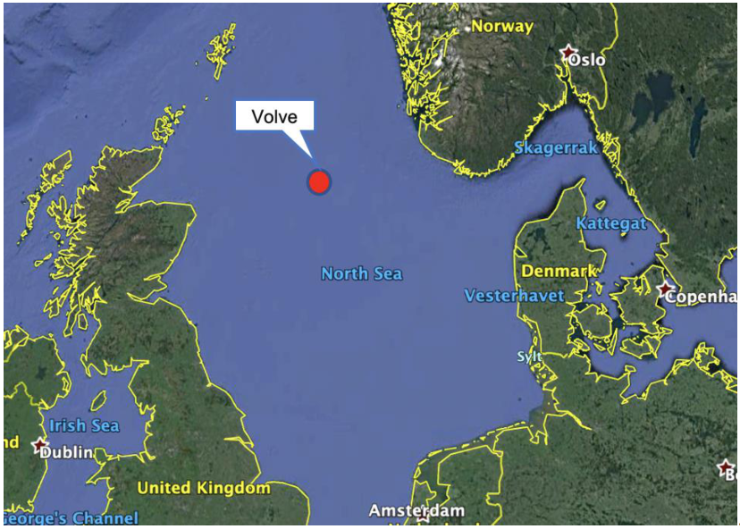
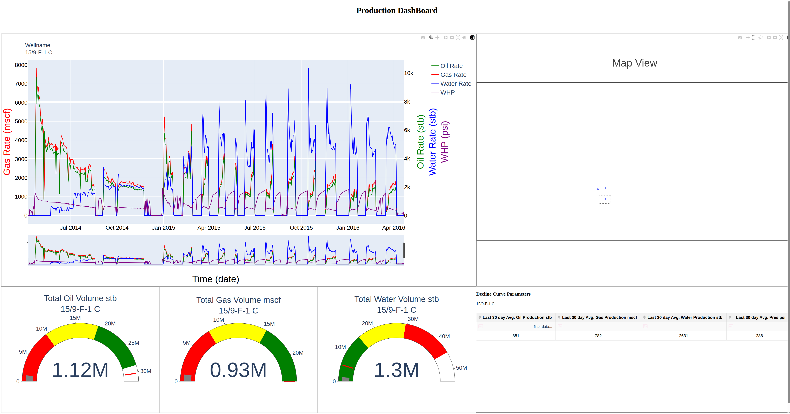
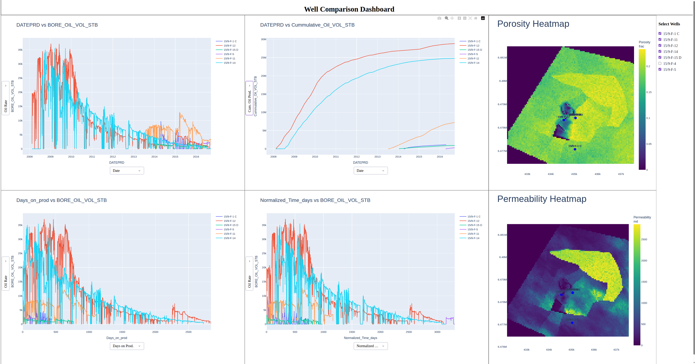
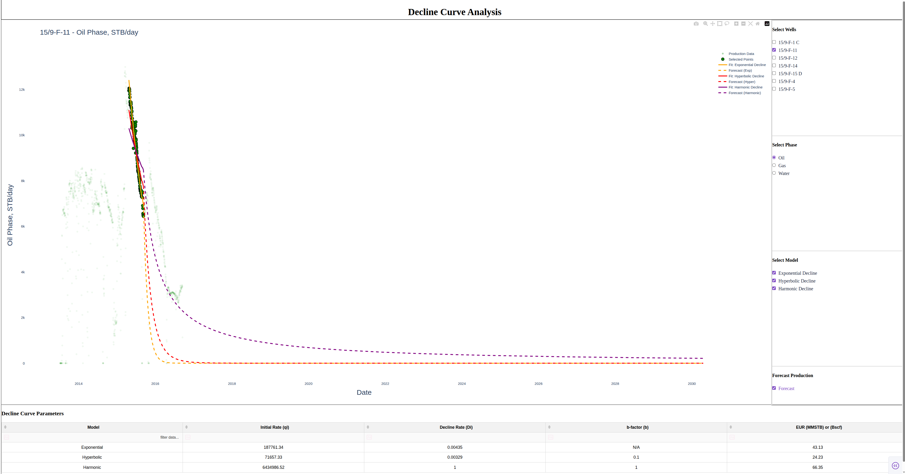

# Volve Reservoir Visualization Project

The Volve oil field is located in Block 15/9 of the central Norwegian North Sea. It is situated approximately 200 kilometers west of Stavanger, Norway,and in a water depth of around 80 meters. The Volve field produced oil and gas from 2008 to 2016 and is now decommissioned, but it remains as one of the most open-source subsurface and production datasets in the energy industry. The aim of this project is to come up with different ways to visualize the production data and perform decline curve analysis. 

<figure>

<figcaption>Source: <a href="https://encrypted-tbn0.gstatic.com/images?q=tbn:ANd9GcT7ex3O5HJRM-omJ3P_GW9B6RS3xKcMWQPhJA&s">Picture of Volve field</a></figcaption>
</figure>

## Modules

- Production Data Analysis.
- Multiple Well Production Comparison
- Decline Curve Analysis.

## Project Structure
```text
├── assets
│   └── style.css
├── new-workspace.jupyterlab-workspace
├── notebooks
│   ├── 1_Load_Clean_Production_data.ipynb
│   ├── 2_Find_Load_plot_X_Y_loc.ipynb
│   ├── 3_Grid_properties.ipynb
│   ├── 4_decline_curve_analysis.ipynb
│   ├── Dash_Decline_Curve.ipynb
│   ├── Dash_Production.ipynb
│   ├── Dash_Well_Comparison.ipynb
│   └── temp-plot.html
├── README.md
├── src
│   ├── Decline_curve.py
│   ├── Find_Load_plot_X_Y_loc.py
│   ├── Load_clean_production_data.py
│   └── Load_Petrophysical_data.py
└── The-geographic-location-of-the-Volve-field.png
```


## Usage
- The **style.css** is a file that is used the control the dropdown box of the Dash_Well_Comparison app.
- The notebooks that starts with **numbers** are mainly workbooks to test out new functions and methods.
- The **.py** files in the src folder are mainly core reusable functions used in the Dashboards.
- The notebooks that starts with **Dash** are the project notebooks.

#### Dash_Production.ipynb
The aim is to select a well on the world map and view its production time plot. The gauges show cumulative production. For oil, the cumulative production is 1.12M STB, highlighted in grey. The red, yellow, and green zones indicate how far the well is from the target cumulative production of 30M STB. Lastly, the table shows the average production over the last 30 days

 - Run the notebook to the every end <br>
 - After execution, open the local Dash server URL in your browser (normally should end with **:8050**).


[Watch Video](Production_fixed.mp4)

#### Dash_Well_Comparison.ipynb
The main goal is to compare different production streams, such as oil, water, and gas, from several wells simultaneously, and relate those trends to the porosity and permeability maps. 
##### Explanation of the time functions
- <u>Date</u>: Calendar Date
- <u>Normalized Time</u>: Days since the start of first production. **Include** days the well was not producing
- <u>Days on</u>: The number of days since the start of first production, **excluding** periods when the well was not producing

Run the notebook to the every end <br>
After execution, open the local Dash server URL in your browser (normally should end with **:8050**).


[Watch Video](Wellcomparison.mp4)

#### Dash_Decline_Curve.ipynb
The goal is to fit a model (curve) to the production data. Up to three models can be fitted simultaneously, and the model parameters can be displayed in the table along with the estimated future production (EUR).<br>
The models are
- <u>Exponetial Decline</u>: Most pessimistic
- <u>Hyperbolic Decline</u>: Less pessimistic than exponential decline
- <u>Harmonic Decline</u>: Most optimistic

The minimizer uses log residuals as the loss function $log(model) - log(actual)$ instead of $(model - actual)$.

This prevents high early-time rates from dominating the objective function. No custom weighting is applied.
Oil and gas production can be fitted and forecasted. Forecasting water production can be meaningless since water production is often not declining. After performing an analysis, please refresh the page before starting another analysis.

 - Run the notebook to the every end <br>
 - After execution, open the local Dash server URL in your browser (normally should end with **:8050**).


[Watch Video](Decline_curve_analysis.mp4)

## Technologies

- Python
- Plotly Dash
- Pandas
- NumPy
- JupyterLab

## Installation
##### 1. Clone the Repository
```bash
git clone https://github.com/adebam/Volve_Project.git
cd 1_Visualization
```
##### 2. Install Dependencies
```bash
mamba env create -f environment.yml
```
Or using Conda:
```bash
conda env create -f environment.yml
```
##### 3. Activate the Environment
```bash
mamba activate volve_project_visualization
```

##### 4. Start JupyterLab
```bash
jupyter lab
```

## License
Copyright (c) 2026 Dayo Adebamiro

Permission is granted to use, copy, modify, and distribute this software
for personal, educational, and research purposes only.

Commercial use is prohibited without prior written permission.

The above copyright notice and this permission notice shall be included in all
copies or substantial portions of the Software.

THE SOFTWARE IS PROVIDED "AS IS", WITHOUT WARRANTY OF ANY KIND, EXPRESS OR
IMPLIED, INCLUDING BUT NOT LIMITED TO THE WARRANTIES OF MERCHANTABILITY,
FITNESS FOR A PARTICULAR PURPOSE AND NONINFRINGEMENT. IN NO EVENT SHALL THE
AUTHORS OR COPYRIGHT HOLDERS BE LIABLE FOR ANY CLAIM, DAMAGES OR OTHER
LIABILITY, WHETHER IN AN ACTION OF CONTRACT, TORT OR OTHERWISE, ARISING FROM,
OUT OF OR IN CONNECTION WITH THE SOFTWARE OR THE USE OR OTHER DEALINGS IN THE
SOFTWARE.
