# WELL ANALYSIS
In this readme, I wil outline the analysis of well 1(15/9-F-1C)

Figure 1 displays the historical time-series data for Well 1. The three target parameters to be predicted—oil volume, gas volume, and water volume—are represented in green, red, and blue, respectively. 

A strong correlation is evident between these target production rates and the operational predictors. Notably, whenever production drops to zero (indicating a well shut-in or downtime event), a direct corresponding change is observed in the sensor predictors—such as sharp drops in wellhead pressure ($AVG\_WHP\_P$) and downhole temperature.

<p align="center">
  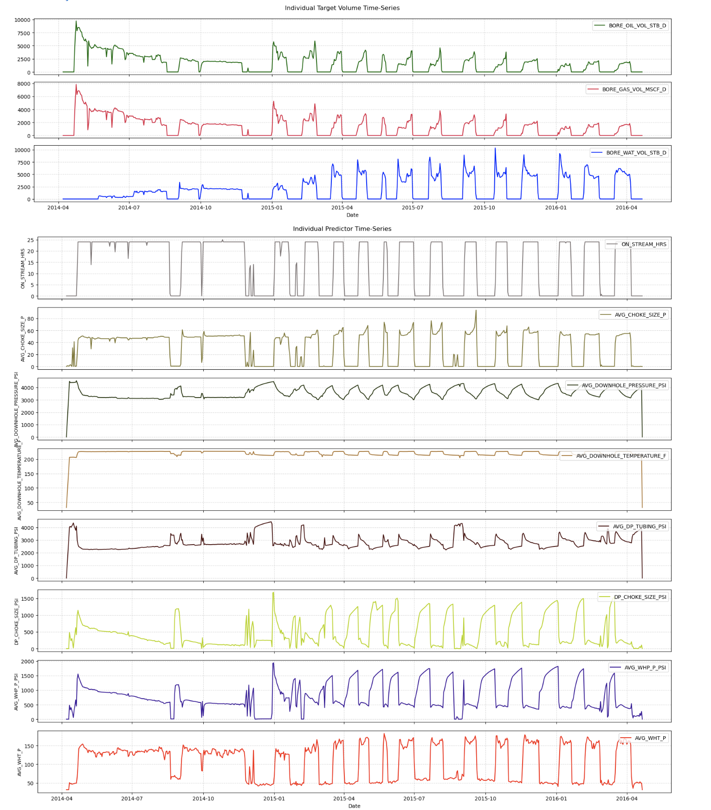<br>
  <i>Figure 1: Time-series plot of pressure, temperature, and fluid volumes for Well 1.</i>
</p>

## Seasonal Plots
Seasonal plots are highly effective for identifying underlying cyclical patterns (weekly, monthly, or yearly) that correlate with field production features. As demonstrated in Figure 2, a distinct cyclical correlation exists between the production rates and the month of the year. 

Peak production periods consistently occur during the winter months, whereas sharp declines are visible in August and September. This late-summer drop typically corresponds to planned seasonal maintenance and turnaround windows for the facility. Consequently, explicitly encoding seasonal and calendar-based features within the engineering pipeline will be critical for the forecasting models to capture these macro trends.

<p align="center">
  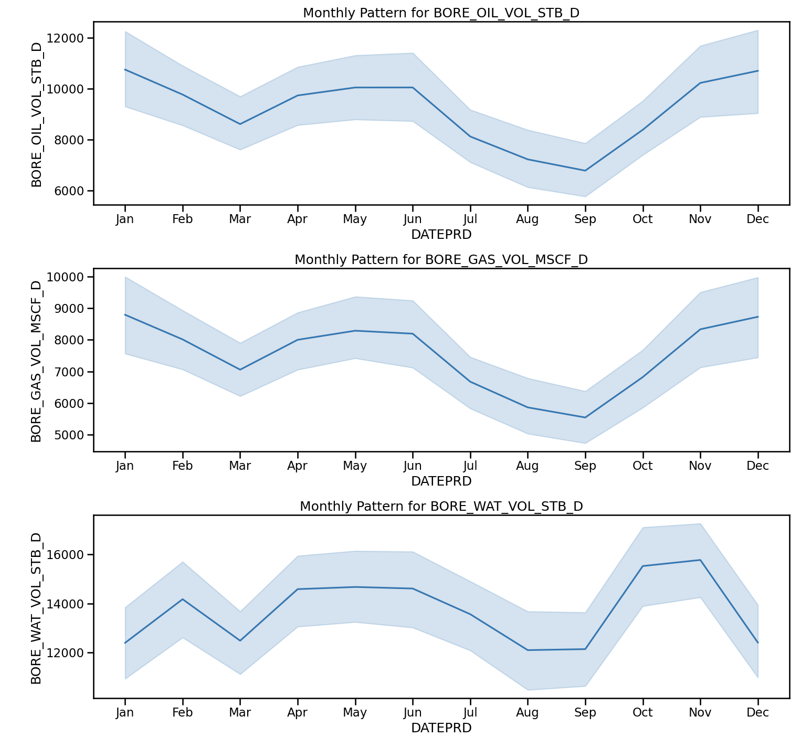<br>
  <i>Figure 2: Monthly cyclical patterns for oil, gas, and water production.</i>
</p>


## STL Decomposition, ACF, PACF, and Stationarity

Many time-series methods work best when the statistical behavior of the series is relatively stable over time. A **stationary time series** has a mean, variance, and autocorrelation structure that do not change substantially with time. Production data are often nonstationary because of reservoir depletion, water breakthrough, choke changes, shut-ins, and other operational events.

**STL decomposition** separates the production series into trend, seasonal, and residual components. Removing the trend and seasonal components can produce a more stationary residual series, making the remaining short-term dependence easier to examine.

The **Autocorrelation Function (ACF)** measures the relationship between current production and its previous values at different lags. The **Partial Autocorrelation Function (PACF)** measures the direct contribution of each lag after accounting for shorter lags. When the original series contains a strong trend, the ACF may remain high across many lags simply because nearby observations follow the same long-term decline. Examining the detrended or residual series can therefore provide a clearer indication of the lags that contain genuine short-term predictive information.

For this project, STL, ACF, and PACF were used mainly as diagnostic tools to understand the production structure and guide lag selection. Strict stationarity is not always required for machine-learning models, especially when trend, cumulative production, operating conditions, and other time-dependent features are included. However, reducing nonstationarity can improve model stability and reduce the risk that the model mistakes long-term decline for meaningful short-term autocorrelation.

The top plot in figure 3 is the original time series, the second is the trend, third is the season and the last plot is the residual
<p align="center">
  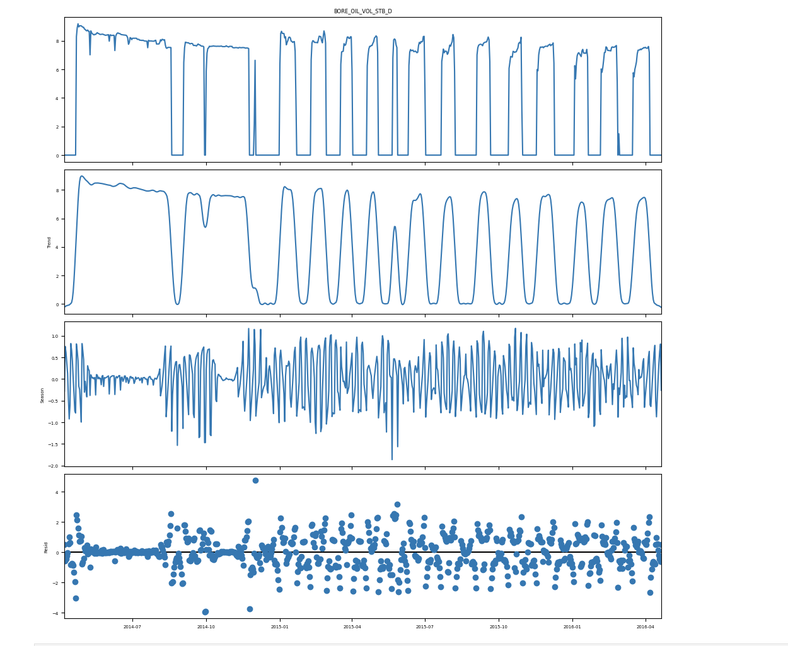<br>
  <i>Figure 3: STL decomposition for oil production.</i>
</p>
Figure 4 presents the detrended and deseasonalized oil-production residuals together with their Autocorrelation Function (ACF) and Partial Autocorrelation Function (PACF). Removing the trend and seasonal components produces a series that fluctuates approximately around zero, suggesting that the transformation improved the stationarity of the original production data.

However, the residual variance does not appear completely constant throughout the production history. The early portion contains a relatively low-variance period, while later observations exhibit larger fluctuations and several extreme values. 

The ACF indicates that the residual series still contains meaningful temporal dependence. In particular, the strong lag-1 autocorrelation and several significant correlations at later lags show that the residuals are not random white noise. This remaining dependence may provide useful predictive information for the machine-learning models.

The PACF provides an initial guide for selecting lagged production features by measuring the direct relationship between the current value and each previous lag after accounting for shorter lags. Several early lags, particularly around lags 1, 2, and 5–10, appear statistically significant or close to the confidence limits.

Although the ACF and PACF provide a useful starting point, they should not be used as the sole feature-selection method. Candidate lag combinations should ultimately be evaluated using chronological time-series cross-validation, model performance, and engineering knowledge of the well’s operating behavior.
<p align="center">
  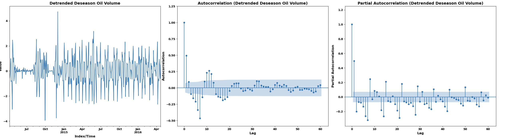<br>
  <i>Figure 4: STL residual stationarity analysis and PACF for lag selection.</i>
</p>

## Lasso-Based Lag Feature Selection Transformer


### Multi-Output Lasso-Based Lag Feature Selection

A custom transformer, `MultiPhaseMultiOutputLassoSelectedLagFeatureAdder`, generated candidate lag features and fitted an independent Lasso model for each production phase. A shared regularization parameter was selected using chronological cross-validation, while each phase was allowed to retain a different set of predictive lag features.

| Transformer output                            | Result |
| --------------------------------------------- | -----: |
| Original columns                              |     13 |
| Total lag features created                    |    377 |
| Candidate lag features evaluated              |    377 |
| Training rows used internally                 |    717 |
| Best shared regularization parameter, `alpha` |    0.1 |
| Best cross-validation RMSE                    | 0.4443 |
| Oil lag features selected by Lasso            |      5 |
| Gas lag features selected by Lasso            |      5 |
| Water lag features selected by Lasso          |      6 |
| Union of Lasso-selected features              |     12 |
| Lag features retained using engineering rules |     10 |
| Final unique lag features retained            |     21 |
| Final dataframe columns returned              |     34 |

Although the three phase-specific Lasso models selected a total of 16 features, some features were selected for more than one target. The union therefore contained 12 unique Lasso-selected lag features.

The transformer also force-retained 10 lags based on engineering knowledge and short-term forecasting requirements. Because one force-kept lag was already present in the Lasso-selected union, the final feature set contained 21 unique lag features:

$$
\begin{aligned}
& 12 \text{ Lasso-selected features} \\
+ \quad & 10 \text{ force-kept features} \\
- \quad & 1 \text{ overlapping feature} \\
\hline
& \mathbf{21 \text{ final lag features}}
\end{aligned}
$$


The final transformed dataframe contained:

$$
13 \text{ original columns} + 21 \text{ selected lag features} = 34 \text{ columns}
$$


This multi-output approach allows oil, gas, and water to select different lag structures while still returning one combined feature table for downstream modeling.


## Window-Based Features

Window-based features were created to summarize recent and long-term production behavior without relying only on individual lag values. All window calculations were shifted so that each feature used only information available before the prediction date, preventing target leakage.

**Rolling-window features** calculate statistics such as the mean, standard deviation, minimum, and maximum over a fixed historical period. These features describe the recent production level, variability, and operating stability while reducing the influence of daily measurement noise.

**Expanding-window features** use all available observations from the beginning of the production history up to the current date. Cumulative oil, gas, and water production provide information about well maturity, depletion, and the overall production stage.

**Rolling-slope features** estimate the direction and rate of change within a recent window. A negative slope may indicate production decline, while a positive slope may represent recovery, ramp-up, or a response to changing operating conditions. Because slopes can be sensitive to noise and shutdowns, several window lengths can be evaluated using chronological cross-validation.

## Trend Features

Trend features were included to represent the long-term evolution of production over the life of the well. The variable $t$ represents the number of days since production began, while $t^2$ allows the model to capture nonlinear behavior such as accelerating or slowing decline.

Additional trend features were created by fitting production curves such as the **logistic, Gompertz, Richards, and hyperbolic models**. The fitted production trend and its slope were intended to provide an engineering-based estimate of the underlying decline pattern.

However, the fitted-curve features were not included in the final model because they were too influential and tended to dominate the other lagged, rolling, and operational variables. They also depended strongly on the selected curve form and could extrapolate unrealistically when future well behavior differed from the historical decline pattern. The simpler $t$ and $t^2$ features were therefore retained because they provided general trend information while allowing the machine-learning model to learn more from recent production history and operating conditions.

## Seasonality Features

Seasonality features were evaluated to determine whether oil, gas, and water production contained recurring weekly, monthly, quarterly, or annual patterns. In this dataset, apparent cycles may reflect operational schedules, separator testing, shutdowns, or facility constraints rather than true reservoir seasonality.

### Datetime and Calendar Features

Datetime features extract information such as the day of the week, week of the year, month, or quarter from the production date. These variables can help the model identify recurring operational patterns, such as production behavior associated with particular weeks or scheduled activities.

Calendar features can work well with Lasso when they are properly encoded, particularly through one-hot encoding. This allows the model to assign a separate coefficient to each calendar period without assuming that one month or weekday is numerically greater than another. However, using raw integer values such as `month = 1, 2, ..., 12` in a linear model may incorrectly imply a linear relationship between the periods.

### Sine and Cosine Transformations

Sine and cosine transformations represent calendar variables as continuous cycles. For example, a monthly cycle can be expressed as:

$$
\sin\left(\frac{2\pi \times \text{month}}{12}\right)
$$

and:

$$
\cos\left(\frac{2\pi \times \text{month}}{12}\right)
$$

This encoding preserves the circular relationship between the end and beginning of a cycle. For example, December and January are treated as neighboring months rather than values at opposite ends of a numerical scale.

Sine and cosine features are particularly useful for linear models such as Lasso because they allow a linear equation to represent smooth cyclic behavior. They also require fewer columns than one-hot encoding.

For tree-based models, sine and cosine features may still help preserve the cyclical boundary, but their benefit is less certain. Decision trees can already learn nonlinear splits from raw calendar variables, although they may struggle to recognize that December and January are close together. Adding sine and cosine features can therefore help in some cases, but it may also introduce redundant variables and unnecessary complexity.

### Fourier Features

Fourier features extend sine and cosine encoding by adding several harmonic frequencies:

$$
\sin\left(\frac{2\pi kt}{P}\right),
\qquad
\cos\left(\frac{2\pi kt}{P}\right)
$$

where $P$ is the cycle length and $k$ represents the harmonic order. Higher-order harmonics allow the model to represent more complex recurring patterns rather than a single smooth seasonal cycle.

Fourier features were evaluated for monthly, quarterly, and annual seasonality but were not retained in the final model. The production history did not show sufficiently stable and repeatable seasonal behavior to justify the additional terms. Many apparent cycles were more likely associated with operational changes, shut-ins, choke adjustments, or production decline.

Adding several Fourier harmonics also increased the number of correlated features and created a risk of fitting temporary historical patterns that may not repeat in the future. Simpler datetime features and basic sine–cosine transformations were therefore preferred because they provided seasonal information with less model complexity and a lower risk of overfitting.

## Final One-Day Lag Features

A final feature-engineering step was added to create one-day-lagged versions of selected production and operating variables that were considered especially important for short-term forecasting. These features represent the most recent information available before the prediction date.

For a variable $x_t$, the one-day-lagged feature is:

$$
x_{t-1}
$$

Examples include previous-day oil, gas, and water production, on-stream hours, gas–oil ratio, and water cut. Shifting these variables by one day ensures that the model does not use same-day target information, thereby preventing data leakage.

This step also guarantees that important recent-history features are retained in the final dataset even when they were not selected automatically during the earlier Lasso-based lag-selection process. Since the first observation has no previous-day value, this transformation introduces one missing row at the beginning of the dataset.

## Final Column Removal and Leakage Prevention

The final feature-engineering step removes columns that would not be available when the forecast is generated and could therefore introduce data leakage. This includes the unshifted oil, gas, and water production values, together with target-derived variables such as same-day GOR and water cut. Only their lagged, rolling, expanding, or otherwise historically available versions are retained as model inputs.

`ON_STREAM_HRS` is also removed for now as a conservative choice because the actual operating hours for a future day may not be known when the forecast is produced. It can later be included if the value is planned in advance, held constant as an operational assumption, or forecast separately.

For each production phase, the target column must remain available temporarily during feature engineering because it is required to create lagged values, rolling statistics, slopes, and other historical features. However, after those features have been generated, the current unshifted target is removed from the predictor matrix and stored separately as the model output:

$$
X_t = \text{historically available engineered features}
$$

$$
y_t = \text{production target}
$$


This ensures that the target is available for constructing valid historical features without allowing the model to use the value it is being asked to predict.

Figure 5 shows the summary of the Feature engineering pipeline. 
<p align="center">
  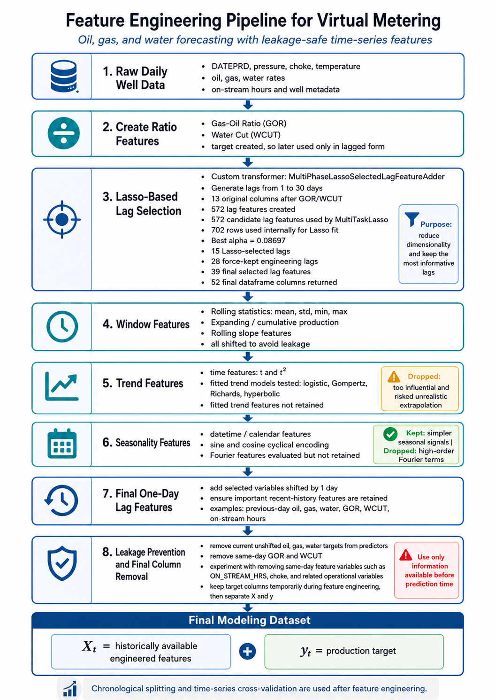<br>
  <i>Figure 5: Feature Engineering Pipeline Summary.</i>
</p>

# Validation Results For Regression Models for One Step Look Ahead Model

After fitting the feature-engineering pipeline on the training data, the original well measurements were transformed into a final modeling dataset containing operational variables, selected lag features, fluid-ratio features, and calendar encodings. These engineered variables allow the models to learn from lagged operating conditions, recent production history, and possible temporal patterns.

The validation dataset is required to compare **Lasso, Ridge, Elastic Net, Random Forest, Gradient Boosting, and LightGBM** before evaluating the final model on the test data. Training performance alone cannot be used for model selection because a model may fit the historical training data well but fail to generalize to a later production period. Validation therefore provides an estimate of how each model is likely to perform on unseen future data.

All models should be compared using the same chronological validation period and the same evaluation metrics, such as RMSE, MAE, and $R^2$.

For the sake of breity, only 3 models are explained.


| Feature group                         | Examples                                                                                            |
| ------------------------------------- | --------------------------------------------------------------------------------------------------- |
| Current operating measurements        | `ON_STREAM_HRS`, `AVG_CHOKE_SIZE_P`, `AVG_WHP_P_PSI`, `AVG_WHT_P`                                   |
| Pressure and temperature measurements | `AVG_DOWNHOLE_PRESSURE_PSI`, `AVG_DOWNHOLE_TEMPERATURE_F`, `AVG_DP_TUBING_PSI`, `DP_CHOKE_SIZE_PSI` |
| Lagged operating variables            | `ON_STREAM_HRS_lag_1D`, `AVG_CHOKE_SIZE_P_lag_7D`, `AVG_WHP_P_PSI_lag_7D`                           |
| Lagged production variables           | `BORE_OIL_VOL_STB_D_lag_1D`, `BORE_GAS_VOL_MSCF_D_lag_1D`, `BORE_WAT_VOL_STB_D_lag_1D`              |
| Lagged fluid-ratio features           | `GOR_MSCF_STB_lag_1D`, `WCUT_lag_1D`, `WCUT_lag_13D`, `WCUT_lag_18D`                                |
| Calendar features                     | `week`, `month`                                                                                     |
| Cyclical calendar features            | `week_sin`, `week_cos`, `month_sin`, `month_cos`                                                    |


## Lasso 
## Lasso-Selected Features

Lasso feature selection was performed using only the **training data**, with chronological time-series cross-validation used to select the regularization strength. Features with nonzero coefficients were retained for each production target.

The coefficient sign indicates the direction of the modeled relationship, while the absolute coefficient is used to rank the selected features by influence.

### Oil Production

| Target               | Selected feature             | Coefficient | Absolute coefficient |
| -------------------- | ---------------------------- | ----------: | -------------------: |
| `BORE_OIL_VOL_STB_D` | `BORE_OIL_VOL_STB_D_lag_1D`  |    0.756511 |             0.756511 |
| `BORE_OIL_VOL_STB_D` | `GOR_MSCF_STB_lag_1D`        |    0.068481 |             0.068481 |
| `BORE_OIL_VOL_STB_D` | `BORE_GAS_VOL_MSCF_D_lag_1D` |    0.064251 |             0.064251 |
| `BORE_OIL_VOL_STB_D` | `WCUT_lag_13D`               |   -0.051837 |             0.051837 |
| `BORE_OIL_VOL_STB_D` | `WCUT_lag_18D`               |   -0.014846 |             0.014846 |

The previous-day oil rate was the dominant predictor of oil production, demonstrating strong short-term persistence. Previous-day GOR and gas production contributed positively, while the negative water-cut coefficients suggest that higher historical water cut was associated with lower oil production.

### Gas Production

| Target                | Selected feature             | Coefficient | Absolute coefficient |
| --------------------- | ---------------------------- | ----------: | -------------------: |
| `BORE_GAS_VOL_MSCF_D` | `BORE_OIL_VOL_STB_D_lag_1D`  |    0.637947 |             0.637947 |
| `BORE_GAS_VOL_MSCF_D` | `BORE_GAS_VOL_MSCF_D_lag_1D` |    0.179474 |             0.179474 |
| `BORE_GAS_VOL_MSCF_D` | `GOR_MSCF_STB_lag_1D`        |    0.095013 |             0.095013 |
| `BORE_GAS_VOL_MSCF_D` | `WCUT_lag_13D`               |   -0.054076 |             0.054076 |
| `BORE_GAS_VOL_MSCF_D` | `WCUT_lag_18D`               |   -0.007951 |             0.007951 |

Previous-day oil production was the strongest selected feature for gas prediction, reflecting the relationship between oil and associated gas production. The previous-day gas rate and GOR were also positively related to future gas production, while increasing historical water cut had a negative relationship.

### Water Production

| Target               | Selected feature                     | Coefficient | Absolute coefficient |
| -------------------- | ------------------------------------ | ----------: | -------------------: |
| `BORE_WAT_VOL_STB_D` | `BORE_WAT_VOL_STB_D_lag_1D`          |    0.591907 |             0.591907 |
| `BORE_WAT_VOL_STB_D` | `WCUT_lag_1D`                        |    0.278632 |             0.278632 |
| `BORE_WAT_VOL_STB_D` | `AVG_DOWNHOLE_TEMPERATURE_F_lag_13D` |   -0.063272 |             0.063272 |
| `BORE_WAT_VOL_STB_D` | `WCUT_lag_13D`                       |   -0.024936 |             0.024936 |
| `BORE_WAT_VOL_STB_D` | `AVG_WHP_P_PSI_lag_7D`               |    0.016249 |             0.016249 |
| `BORE_WAT_VOL_STB_D` | `AVG_DOWNHOLE_TEMPERATURE_F_lag_7D`  |   -0.005161 |             0.005161 |
| `BORE_WAT_VOL_STB_D` | `month`                              |   -0.004588 |             0.004588 |
| `BORE_WAT_VOL_STB_D` | `AVG_DOWNHOLE_TEMPERATURE_F_lag_14D` |   -0.000079 |             0.000079 |

The previous-day water rate and water cut were the dominant predictors of water production. Additional temperature, pressure, and calendar features were retained, although their coefficients were considerably smaller. This suggests that most of the predictable water behavior was represented by recent water-production history, with operating conditions providing smaller corrections.

### Overall Summary

| Production phase | Number of selected features | Strongest selected feature  | Strongest coefficient |
| ---------------- | --------------------------: | --------------------------- | --------------------: |
| Oil              |                           5 | `BORE_OIL_VOL_STB_D_lag_1D` |              0.756511 |
| Gas              |                           5 | `BORE_OIL_VOL_STB_D_lag_1D` |              0.637947 |
| Water            |                           8 | `BORE_WAT_VOL_STB_D_lag_1D` |              0.591907 |

Oil and gas selected the same five lagged production and fluid-ratio features, although their coefficient magnitudes differed. Water selected a broader combination of production history, fluid composition, temperature, pressure, and calendar information.

Across the three targets, Lasso retained **12 unique features**:

| Feature group               | Features selected                                                                                               |
| --------------------------- | --------------------------------------------------------------------------------------------------------------- |
| Lagged production features  | `BORE_OIL_VOL_STB_D_lag_1D`, `BORE_GAS_VOL_MSCF_D_lag_1D`, `BORE_WAT_VOL_STB_D_lag_1D`                          |
| Lagged fluid-ratio features | `GOR_MSCF_STB_lag_1D`, `WCUT_lag_1D`, `WCUT_lag_13D`, `WCUT_lag_18D`                                            |
| Lagged temperature features | `AVG_DOWNHOLE_TEMPERATURE_F_lag_7D`, `AVG_DOWNHOLE_TEMPERATURE_F_lag_13D`, `AVG_DOWNHOLE_TEMPERATURE_F_lag_14D` |
| Lagged pressure feature     | `AVG_WHP_P_PSI_lag_7D`                                                                                          |
| Calendar feature            | `month`                                                                                                         |

Coefficient magnitudes are directly comparable only when the predictor variables—and preferably the target variables—were standardized consistently before fitting Lasso.


### Lasso Performance on Validation Data

The independent Lasso models reproduced the general production behavior of oil, gas, and water, including decline periods, shut-ins, restarts, and short-term rate changes. The close agreement between the actual and predicted curves indicates that the lagged production and operating features captured much of the one-day-ahead behavior.

| Target | Validation RMSE | Validation MAE |
| ------ | --------------: | -------------: |
| Oil    |          601.55 |         302.38 |
| Gas    |          493.37 |         244.85 |
| Water  |        1,481.78 |         686.96 |

Oil and gas showed similar training and validation performance, suggesting that the models generalized reasonably well to the later validation period. Their crossplots were concentrated around the 45-degree line, although some high-rate peaks and rapid transitions were underpredicted.

Water was more difficult to predict. Its validation RMSE increased from approximately 672 on the training data to 1,482 on validation, and the crossplot displayed greater scatter and several large errors. This suggests that water production was less stable and may depend on more complex operating changes or production regimes than oil and gas.

Overall, the one-step-ahead Lasso models provided a strong linear baseline, particularly for oil and gas, but the results also show that RMSE is strongly influenced by occasional large errors during production peaks, startups, and rapid rate changes.


<p align="center">
  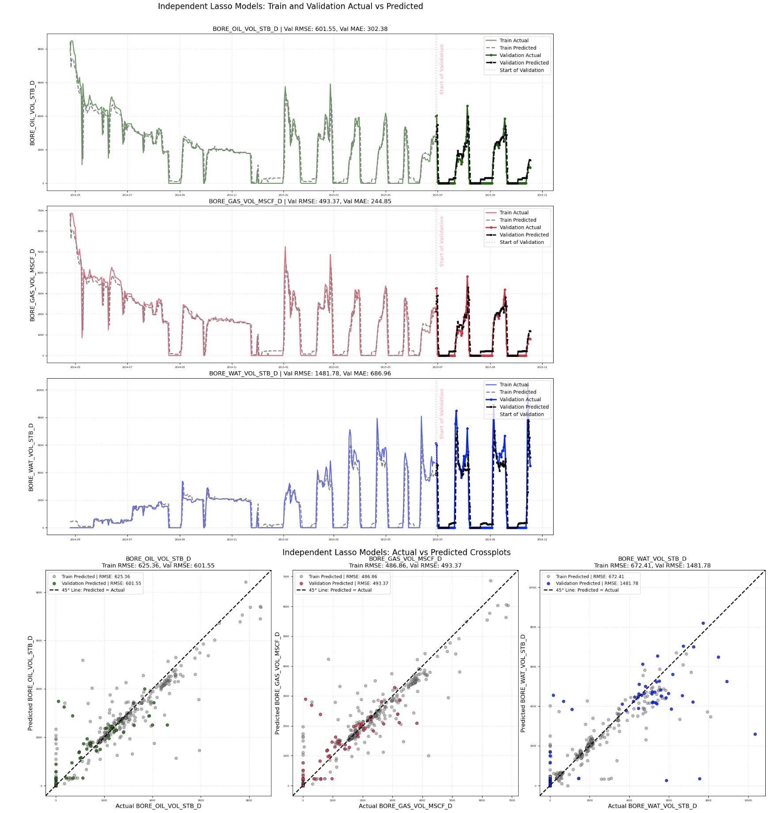<br>
  <i>Figure 6: Lasso Performance on Onestep Lookahead.</i>
</p>

### Random Forest Performance on Validation Data


The Random Forest models captured the main production cycles, including shut-ins, restarts, and periods of increasing production. Validation performance was strongest for gas, while water remained the most difficult phase to predict.

| Target | Validation RMSE | Validation MAE |
| ------ | --------------: | -------------: |
| Oil    |          617.93 |         310.71 |
| Gas    |          486.07 |         238.18 |
| Water  |        1,641.44 |         873.37 |

The crossplots show that Random Forest tended to smooth extreme production values and underpredict high-rate observations. This behavior is especially visible for water, where many predictions are concentrated around a limited range rather than following the highest measured rates. This occurs because tree-based models generally predict averages from previously observed regions and do not extrapolate well beyond the production conditions represented in the training data.

Compared with Lasso, Random Forest produced slightly better gas results but weaker oil and water predictions. Overall, the model captured nonlinear operating behavior, but its tendency to flatten peaks and rapid transitions limited its performance for this well.


<p align="center">
  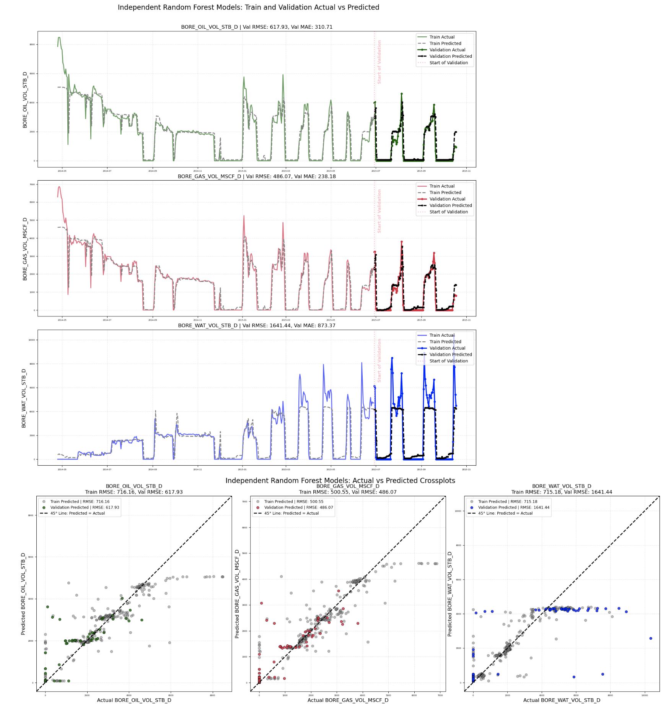<br>
  <i>Figure 7: Random Forest Performance for Onestep Lookahead on Validation Data set.</i>
</p>

### LightGBM Performance on Validation Data


The LightGBM linear-tree models captured the main production cycles, including shut-ins, restarts, decline periods, and short-term rate changes. By fitting a local linear model within each tree leaf, the approach produced smoother predictions than a conventional constant-leaf tree model.

| Target | Training RMSE | Validation RMSE | Validation MAE |
| ------ | ------------: | --------------: | -------------: |
| Oil    |        514.81 |          579.85 |         323.28 |
| Gas    |        456.57 |          490.41 |         276.80 |
| Water  |        500.11 |        1,468.29 |         779.62 |

Oil and gas showed relatively similar training and validation RMSE values, suggesting reasonable generalization to the later validation period. The predicted curves followed the overall shape of the measured production, although rapid startups and high-rate peaks were sometimes underpredicted.

Water remained the most difficult phase to model. Its validation RMSE was substantially higher than its training RMSE, indicating that the water behavior in the validation period differed from the patterns learned during training. The water crossplot also shows greater scatter and several large underpredictions at high production rates.

Overall, the linear-tree LightGBM model performed strongly for oil and provided the lowest water RMSE among the models evaluated so far. However, its validation MAE remained relatively high, particularly for gas and water, showing that the model still struggled during abrupt operating changes and extreme production events.


<p align="center">
  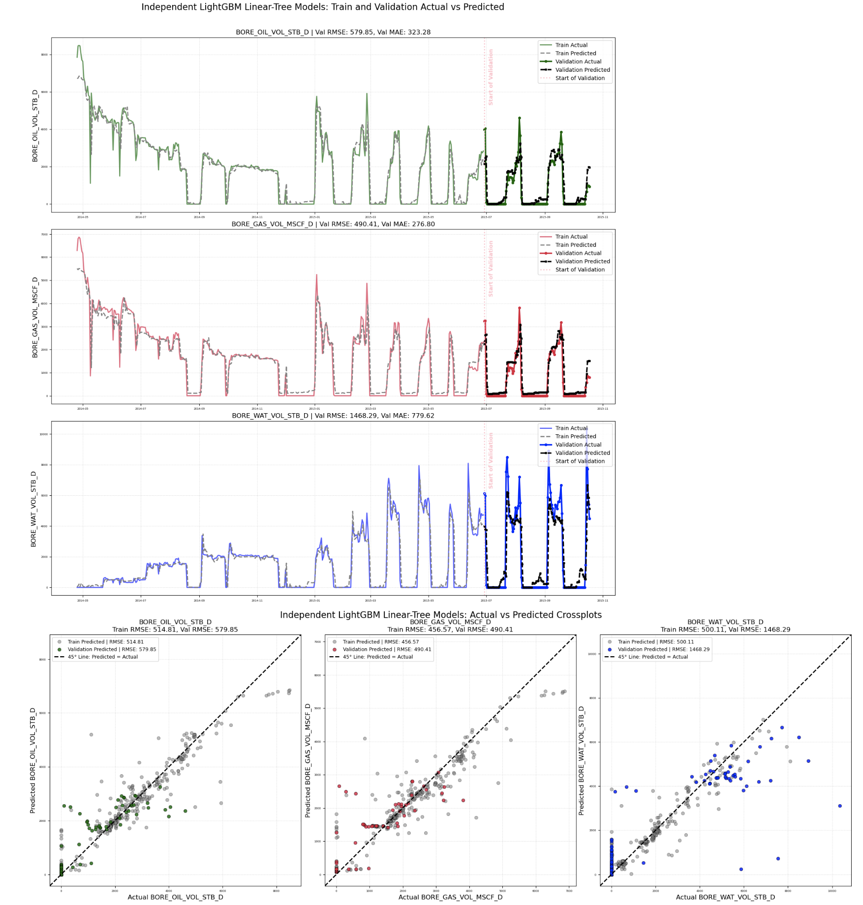<br>
  <i>Figure 8: Light GBM Performance for Onestep Lookahead on Validation Data set</i>
</p>

### Need for another model.
The one-step-ahead model provides a strong benchmark for evaluating whether the engineered features and regression models can predict the next day’s oil, gas, and water rates. However, it is not a practical long-term virtual-metering solution because each new prediction depends on the actual phase rates from the previous day.

In operation, this would require frequent separator measurements to update the model before predicting the following day. Since the objective is to estimate production between periodic well tests, these actual oil, gas, and water measurements may not be available daily.


## Recurisve Models

A recursive forecasting model addresses this limitation by starting with the latest measured phase rates and feeding each prediction back into the feature history to generate the following forecast:

$$
\hat{y}*{t+1}
\longrightarrow
\hat{y}*{t+2}
\longrightarrow
\hat{y}*{t+3}
\longrightarrow
\cdots
\longrightarrow
\hat{y}*{t+H}
$$

The recursive models will be evaluated using three forecast horizons:

| Forecast horizon | Purpose                                                                                                    |
| ---------------- | ---------------------------------------------------------------------------------------------------------- |
| **7 days**       | Evaluate short-term recursive performance and determine how quickly prediction errors begin to accumulate. |
| **14 days**      | Evaluate medium-term performance when the model relies on its own predictions for a longer period.         |
| **30 days**      |Evaluate long-term performance when the model relies on its own predictions for a longer period..           |

For each horizon, the model begins with the latest available actual production rates:

$$
\mathbf{y}_{t}^{\text{actual}} = \left( y_t^{\text{oil}},\, y_t^{\text{gas}},\, y_t^{\text{water}} \right)
$$

It then recursively predicts production until the selected horizon is reached:

$$
\hat{\mathbf{y}}_{t+h} = f\left( \hat{\mathbf{y}}_{t+h-1},\, \hat{\mathbf{y}}_{t+h-2},\, \mathbf{X}_{t+h-1} \right), \qquad h=1,2,\ldots,H
$$


where $H$ is equal to 7, 14, or 30 days.

At the end of each forecast horizon, the predicted rates are compared with the newly available actual measurements. The measured oil, gas, and water rates are then added to the production history and used to initialize the next recursive forecast block.

```text
Latest actual separator measurement
                 |
                 v
       Recursive forecast block
                 |
       +---------+---------+
       |         |         |
     7 days    14 days   30 days
       |         |         |
       +---------+---------+
                 |
                 v
Compare predictions with actual rates
                 |
                 v
Update history with measured phase rates
                 |
                 v
Begin the next forecast block
```

The primary limitation of recursive forecasting is error propagation. Because each predicted value becomes an input for later predictions, small early errors may grow as the forecast horizon increases:

$$
\text{error at }t+1
\longrightarrow
\text{input error at }t+2
\longrightarrow
\text{larger uncertainty at later horizons}
$$

Comparing the 7-, 14-, and 30-day horizons will show how model performance deteriorates with increasing forecast length. The one-step-ahead results therefore represent the best-case short-term benchmark, while the recursive results provide a more realistic evaluation of how the virtual meter would perform between physical separator measurements.


### Lasso


<p align="center">
  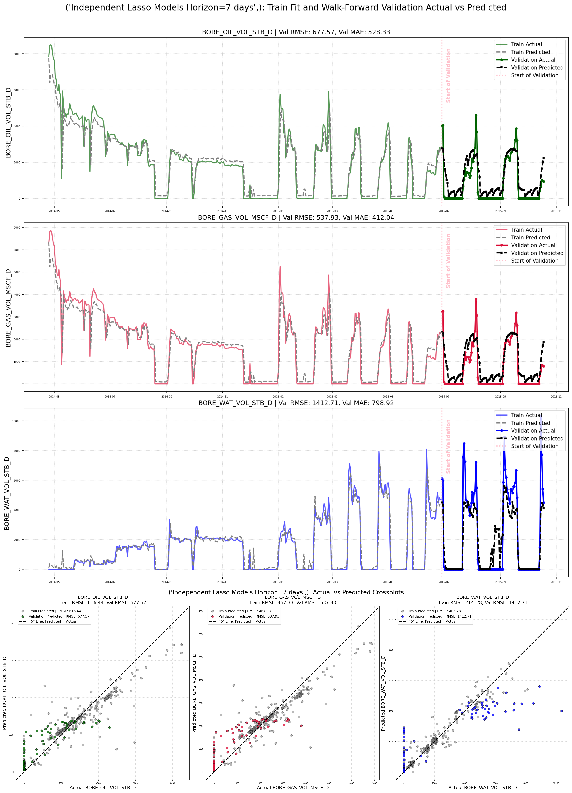<br>
  <i>Figure 9: Lasso Recursive 7 Day Horizon Model</i>
</p>


<p align="center">
  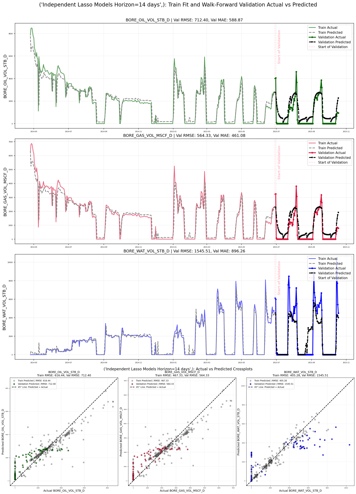<br>
  <i>Figure 10: Lasso Recursive 14 Day Horizon Model</i>
</p>

<p align="center">
  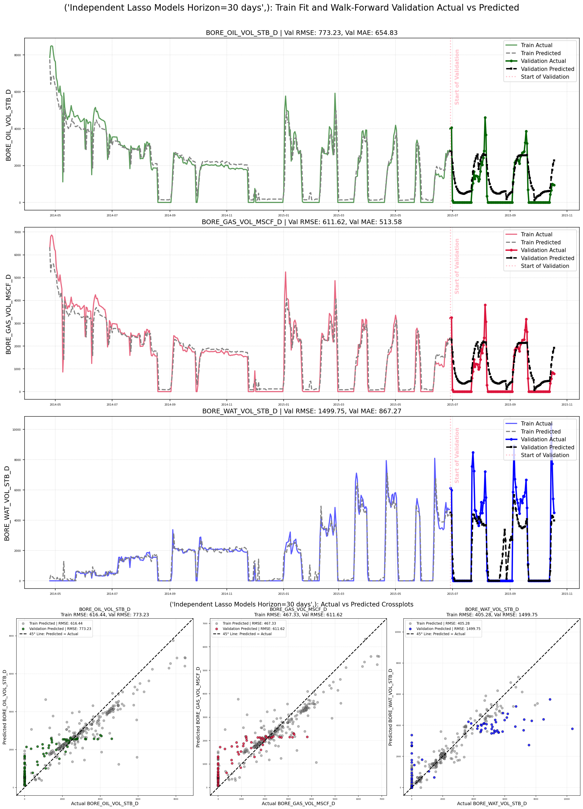<br>
  <i>Figure 11: Lasso Recursive 30 Day Horizon Model</i>
</p>


Performance generally declined as the recursive horizon increased, reflecting error accumulation from feeding predictions back into the model. The **7-day horizon produced the most reliable overall results**, while the 30-day forecast showed greater drift, particularly for oil and gas. Water remained the most difficult phase to predict across all horizons.

### Ridge

<p align="center">
  <br>
  <i>Figure 12: Ridge Recursive 7 Day Horizon Model</i>
</p>

<p align="center">
  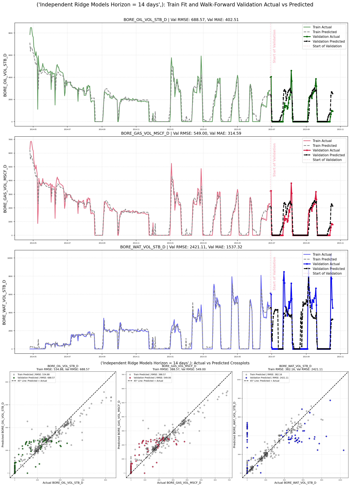<br>
  <i>Figure 13: Ridge Recursive 14 Day Horizon Model</i>
</p>

<p align="center">
  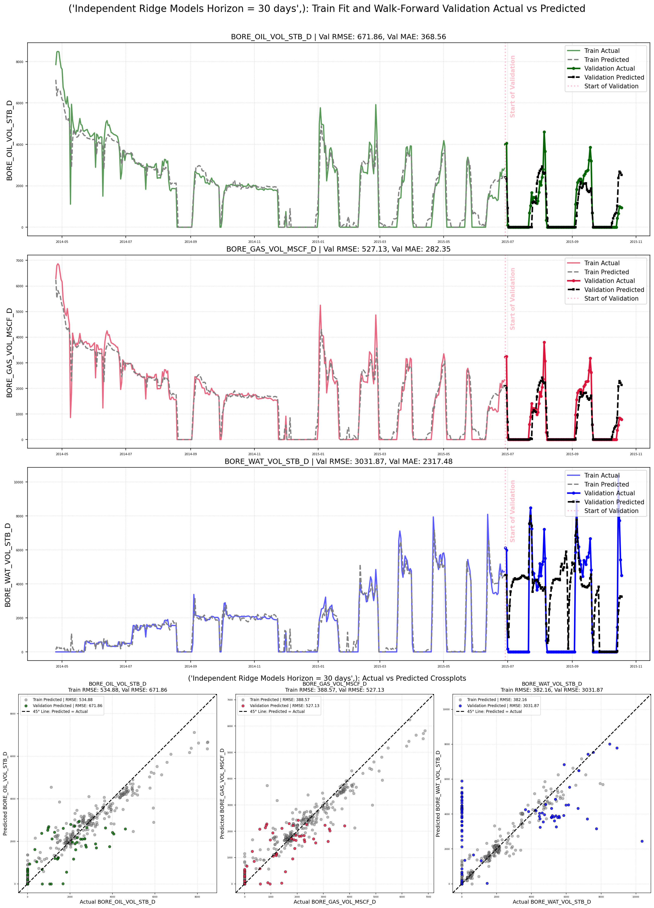<br>
  <i>Figure 14: Ridge Recursive 30 Day Horizon Model</i>
</p>
Ridge produced fairly stable oil and gas forecasts across the three horizons, with the best overall results occurring at 7 days. Water performance deteriorated sharply as the horizon increased, showing substantial error accumulation and making Ridge unsuitable for longer-term water forecasting.

### ElasticNet
<p align="center">
  <br>
  <i>Figure 15: ElasticNet Recursive 7 Day Horizon Model</i>
</p>

<p align="center">
  <br>
  <i>Figure 16: ElasticNet Recursive 14 Day Horizon Model</i>
</p>

<p align="center">
  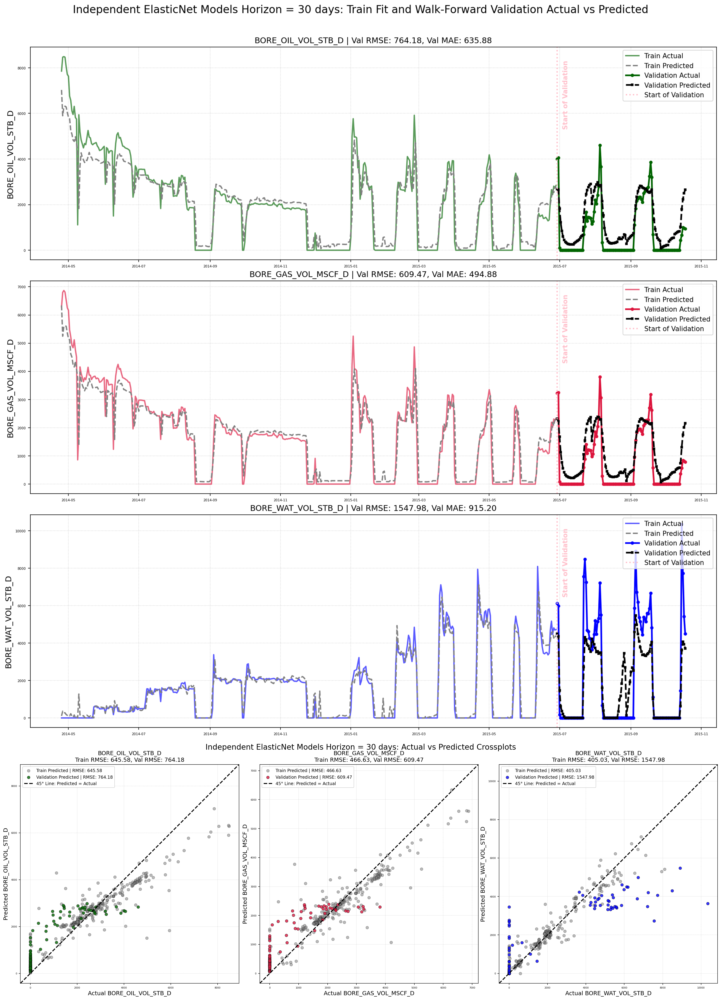<br>
  <i>Figure 17: ElasticNet Recursive 30 Day Horizon Model</i>
</p>


Elastic Net performance generally worsened as the forecast horizon increased, with the **7-day horizon providing the best overall results**. Oil and gas showed increasing recursive drift, while water remained the most difficult and variable phase to forecast.

### Random Forest
<p align="center">
  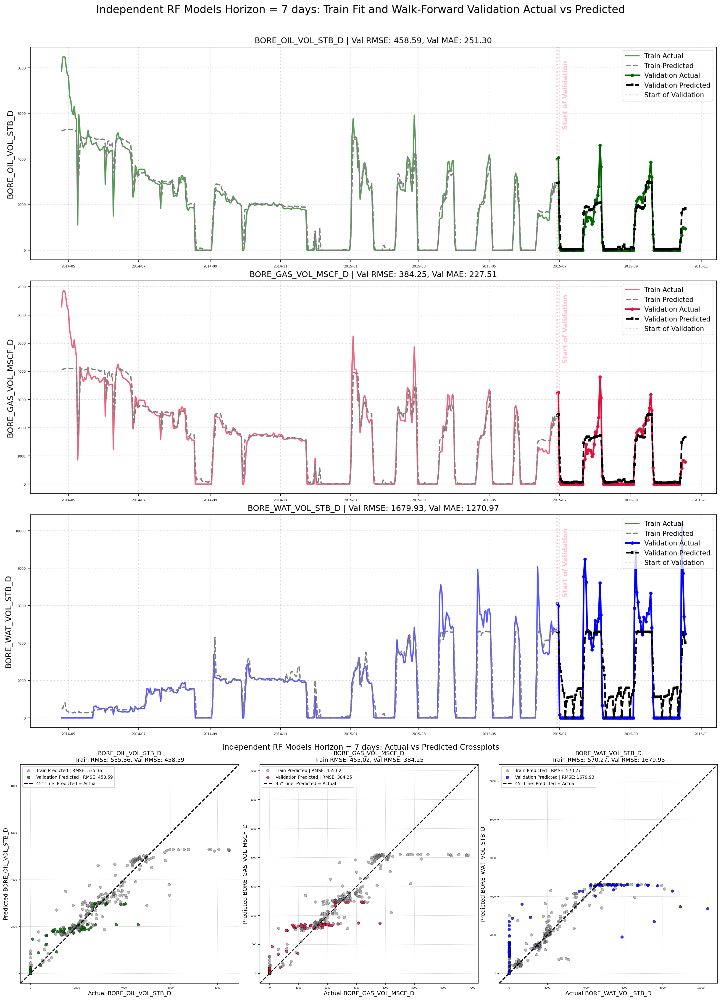<br>
  <i>Figure 18: Random Forest Recursive 7 Day Horizon Model</i>
</p>

<p align="center">
  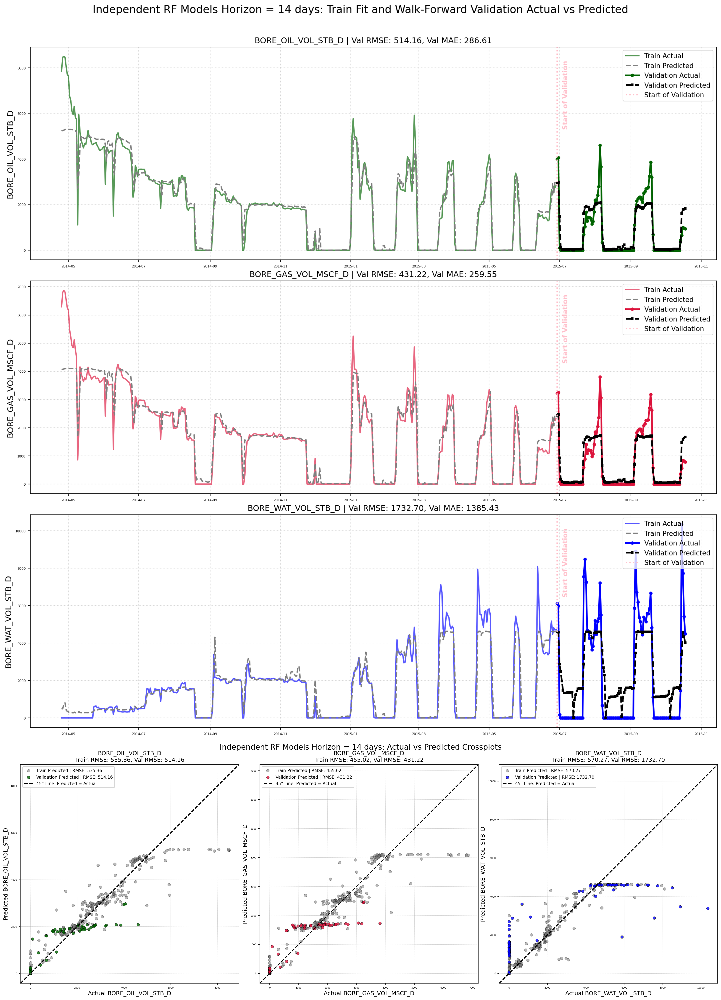<br>
  <i>Figure 19: Random Forest Recursive 14 Day Horizon Model</i>
</p>

<p align="center">
  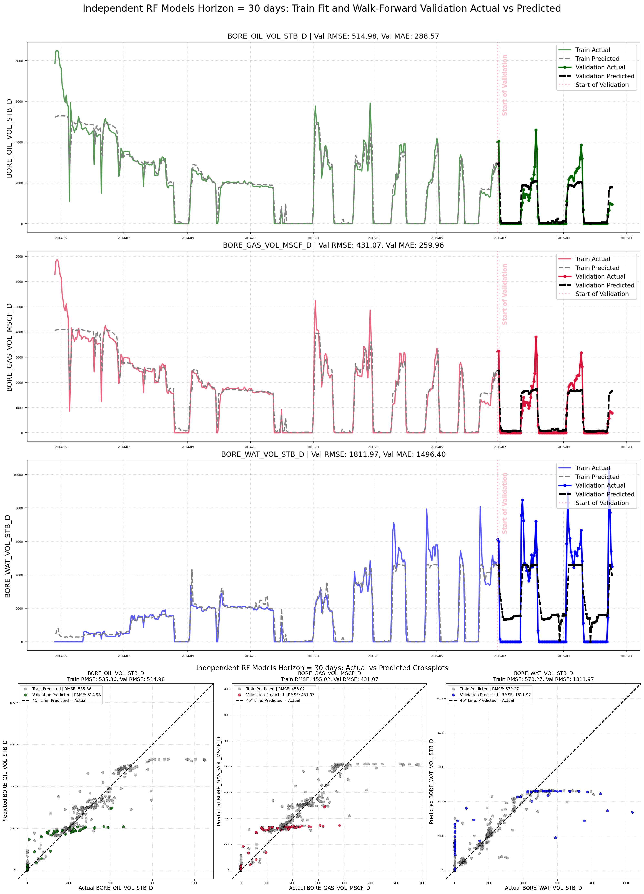<br>
  <i>Figure 20: Random Forest Recursive 30 Day Horizon Model</i>
</p>
### Recursive Random Forest Results

Random Forest achieved lower RMSE than Ridge for all three production phases. However, RMSE alone is not sufficient for selecting the best forecasting model. The time-series plots must also be examined to determine whether the predictions reproduce realistic production behavior.

The Random Forest forecasts frequently plateau at fixed values, underestimate high-rate periods, and produce abrupt step-like changes. This occurs because tree-based models interpolate within patterns observed during training and generally cannot extrapolate to new production conditions.

Ridge has somewhat higher RMSE but produces smoother and more physically continuous forecasts. Therefore, model selection should consider both numerical metrics and the quality of the predicted production profiles, rather than choosing a model based only on the lowest RMSE.


### Gradient Boost
<p align="center">
  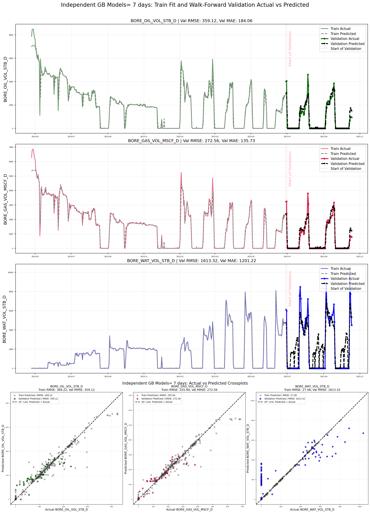<br>
  <i>Figure 21: Gradient Boost Recursive 7 Day Horizon Model</i>
</p>


<p align="center">
  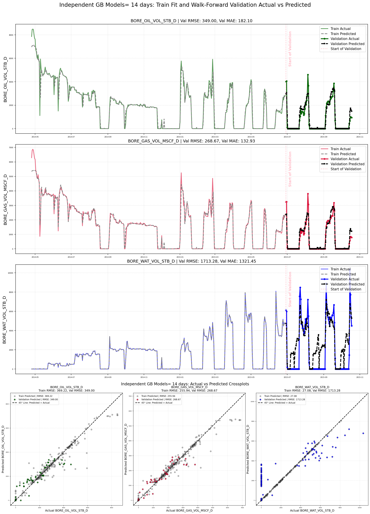<br>
  <i>Figure 22: Gradient Boost Recursive 14 Day Horizon Model</i>
</p>

<p align="center">
  <br>
  <i>Figure 23: Gradient Boost Recursive 30 Day Horizon Model</i>
</p>

Gradient Boosting provided the strongest oil and gas forecasts so far, with lower errors than both Random Forest and Ridge across all three horizons. The time plots also show better tracking of production ramps, shut-ins, and restarts, with less plateauing than Random Forest.

Performance remained relatively stable from 7 to 30 days. However, water production was still difficult to predict and was frequently underpredicted. Overall, Gradient Boosting is currently the best candidate for oil and gas, while water may require a separate model.

### Light GBM
<p align="center">
  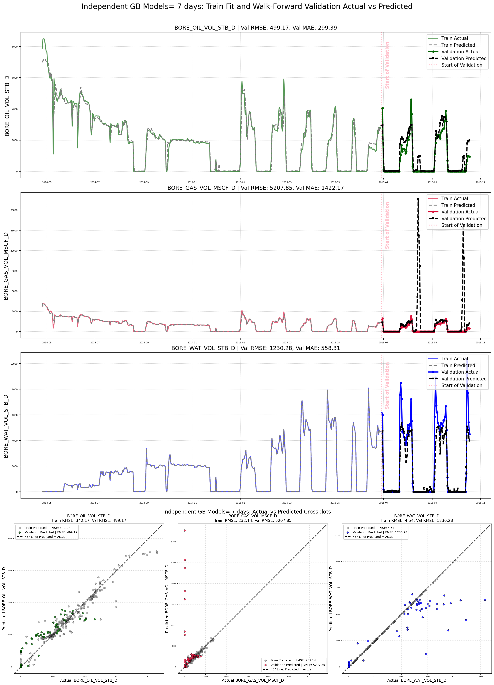<br>
  <i>Figure 24: Light GBM Recursive 7 Day Horizon Model</i>
</p>

<p align="center">
  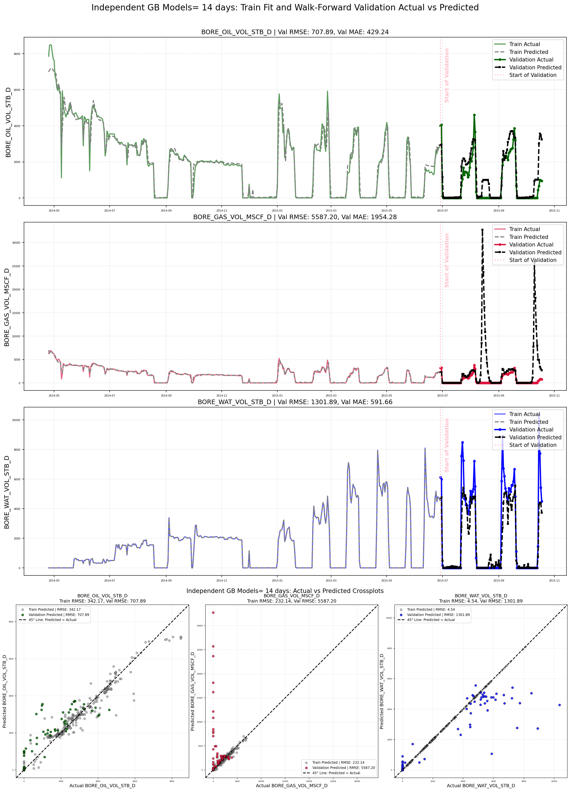<br>
  <i>Figure 25: Light GBM Recursive 14 Day Horizon Model</i>
</p>


<p align="center">
  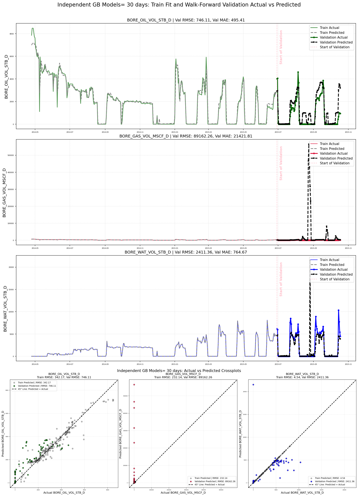<br>
  <i>Figure 26: Light GBM Recursive 30 Day Horizon Model</i>
</p>


LightGBM was unstable during recursive forecasting. Although the 7-day oil and water results were competitive, gas predictions produced extreme unrealistic spikes, which became catastrophic at the 30-day horizon.

Compared with the other models:

* **Gradient Boosting** gave the most accurate and stable oil and gas forecasts.
* **Random Forest** was stable but produced flattened, capped predictions.
* **Ridge** had higher errors but generated smoother and more reliable forecasts.
* **LightGBM** showed the greatest recursive instability and is unsuitable without stronger constraints or clipping.

This demonstrates why time plots must be reviewed alongside RMSE: a few explosive predictions can reveal model failure that average metrics alone may not fully explain.

## Choosing a Model for Final Test & Deployment

Six regression algorithms were evaluated using recursive forecast horizons of **7, 14, and 30 days**. Among the strongest-performing models, the change in validation performance across the three horizons was relatively small. Although shorter horizons generally reduce recursive error accumulation, the improvement from using 7- or 14-day horizons was not large enough to outweigh the operational benefit of forecasting an entire month.

A **30-day recursive horizon** was therefore selected for deployment. This configuration allows the virtual meter to estimate daily oil, gas, and water rates between monthly separator measurements. Once a new physical measurement becomes available, the production history can be updated and the next 30-day forecasting cycle can begin.

Model selection was based on more than RMSE and MAE. The time-series plots were also reviewed to determine whether each model produced stable and physically reasonable production profiles, correctly represented shut-ins and restarts, and avoided excessive recursive drift.

### Phase-Specific Model Selection

The results showed that no single model family was optimal for all three production phases.

| Production phase | Selected model    | Selection rationale                                                                                                    |
| ---------------- | ----------------- | ---------------------------------------------------------------------------------------------------------------------- |
| Oil              | Gradient Boosting | Produced the most accurate and stable recursive oil forecasts across the evaluated horizons.                           |
| Gas              | Gradient Boosting | Provided the best overall gas performance and followed the main production changes more closely than the other models. |
| Water            | LightGBM          | Provided the strongest water predictions, although occasional unrealistic spikes were observed.                        |

Gradient Boosting was selected for oil and gas because it combined strong numerical performance with realistic time-series behavior. LightGBM was selected for water because it provided the best overall water forecast performance. However, its occasional prediction spikes indicate that additional deployment safeguards are required, such as non-negative clipping, engineering-based upper limits, anomaly detection, and fallback predictions when unrealistic values are generated.

### Advantage of Independent Phase Models

A major advantage of training oil, gas, and water models independently is that each production phase can use the model family best suited to its behavior.

A multitask model or a shared multi-output model generally requires all three targets to use the same underlying regression algorithm:

$$
\left[ \hat{q}_{o,t},\, \hat{q}_{g,t},\, \hat{q}_{w,t} \right] = f\left(\mathbf{X}_t\right)
$$

This simplifies the modeling architecture but may force one or more phases to use a model that is not optimal for them. With independent models, the deployed system becomes:

$$
\hat{q}_{o,t} = f_{\text{GB, oil}}\left(\mathbf{X}_{o,t}\right)
$$

$$
\hat{q}_{g,t} = f_{\text{GB, gas}}\left(\mathbf{X}_{g,t}\right)
$$

$$
\hat{q}_{w,t} = f_{\text{LGBM, water}}\left(\mathbf{X}_{w,t}\right)
$$


This approach allows each phase to have its own:

* model family;
* hyperparameters;
* feature set;
* regularization strategy;
* prediction constraints;
* retraining schedule.

The final deployment is therefore a **hybrid virtual-metering system** rather than a single shared regression model. This provides greater flexibility and makes it possible to select the strongest available model for each production phase.

### Performance of the Model on Test data.
## Performance on the Test Data

After selecting the forecast horizon and the best model for each production phase using the validation results, the selected models were refitted using the combined **training and validation datasets**. This allowed the final models to learn from all historical information available before the test period.

The refitted models were then evaluated once on the previously unseen test data using the same 30-day recursive forecasting procedure. These results provide the most realistic estimate of how the deployed virtual-metering system may perform on future production data.

The test dataset was not used for feature selection, hyperparameter tuning, model comparison, or forecast-horizon selection, thereby preserving an unbiased final assessment of model performance.

In the test-result plots:

Train represents the combined training and validation data.
Validation now represents the test data.
The vertical Start of Validation line marks the beginning of the test period.

Although the original plotting labels were retained, the results shown after this boundary represent true out-of-sample test performance. The test data were not used for feature selection, model comparison, hyperparameter tuning, or forecast-horizon selection.

<p align="center">
  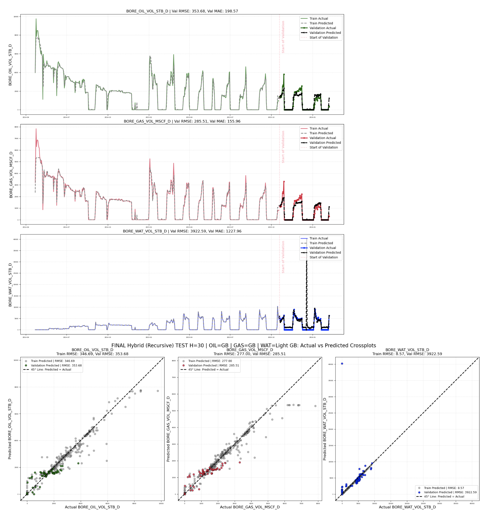<br>
  <i>Figure 27: Final Performance of Model on Test Data</i>
</p>

| Phase | Selected model    | Train RMSE | Train MAE | Train R² | Test RMSE | Test MAE | Test R² | Train points | Test points |
| ----- | ----------------- | ---------: | --------: | -------: | --------: | -------: | ------: | -----------: | ----------: |
| Oil   | Gradient Boosting |     346.69 |    142.62 |   0.9657 |    353.68 |   198.57 |  0.8495 |          545 |         112 |
| Gas   | Gradient Boosting |     277.00 |    113.64 |   0.9670 |    285.51 |   155.96 |  0.8706 |          545 |         112 |
| Water | LightGBM          |       8.57 |      5.92 |   1.0000 |  3,922.59 | 1,227.96 | -1.0448 |          545 |         112 |


The final 30-day recursive hybrid model performed well for oil and gas, with RMSE values of **353.68 STB/D** and **285.51 MSCF/D**, respectively. Both Gradient Boosting models followed the main production cycles, shut-ins, and restarts reasonably well.

Water performance was considerably weaker, with an RMSE of **3,922.59 STB/D**. Although most water predictions followed the general production pattern, one extreme LightGBM spike substantially increased the RMSE. This indicates that the water model requires prediction limits, anomaly detection, or reconsideration before deployment.

Overall, the unseen test results support the selected Gradient Boosting models for oil and gas, while the LightGBM water model remains the main limitation of the final virtual-metering system, as it overfited the data.

The model is now ready for deployment!

# below
Effect of Current and Lagged Operating Measurements

The feature-engineering pipeline was tested both with current operating measurements and with operating variables shifted by at least one day. For the one-step-ahead model, using lagged operating measurements produced better validation results. This configuration also maintains a clear forecasting relationship in which information available through day $t$ is used to predict production on day $t+1$.

For the recursive models, retaining the current operating measurements produced better results. Although future oil, gas, and water rates are unavailable between separator tests, sensor variables such as wellhead pressure, temperature, choke size, and on-stream hours may still be recorded daily. These measurements provide updated information about the actual well condition and help reduce the drift caused by repeatedly feeding predicted production rates back into the model.

The recursive workflow can therefore be represented as:

y
^
	​

t
	​

=f(
y
^
	​

t−1
	​

,X
t
measured
	​

)

where $\hat{\mathbf{y}}_{t-1}$ contains the previously predicted oil, gas, and water rates, while $\mathbf{X}_t^{\text{measured}}$ contains the current sensor and operating measurements.

This distinction is important: the production rates are forecast recursively, but the operating variables may be updated with real daily measurements when they are available. If a current operating variable is not available at prediction time, it must instead be lagged, held constant, defined from an operating plan, or forecast separately.