# WELL ANALYSIS
This section presents the analysis of Well 3 (15/9-F-12). For brevity, the discussion focuses primarily on the best-performing recursive models and whether a direct forecasting approach can improve their performance.

Before presenting the modeling results, the production and operating time series are examined using time plots, STL decomposition, autocorrelation, and partial autocorrelation. This preliminary analysis helps explain why Well 3 is more difficult to forecast than Well 1

## Rate & Feature Time plots
Figure 1 shows the historical oil, gas, and water rates together with the available operating measurements.

Several important behaviors can be observed:

1. Oil and gas production generally decline over time but contain frequent shut-ins, restarts, and abrupt rate changes.
2. Shortly before 2015, water production decreases significantly and shifts into a much lower production regime.
3. Shortly after 2015, oil and gas production show a moderate increase, interrupting the previous decline pattern.
4. Several operating measurements contain sudden level changes. For example, the downhole temperature and tubing-pressure measurements show major shifts that may represent changes in sensor behavior, calibration, completion configuration, or data availability.
5. Changes in the production targets do not always correspond clearly with changes in the available operating variables. Similar pressure or choke conditions can therefore be associated with substantially different production rates.
6. The dataset contains frequent shut-ins and short-duration interruptions, producing many abrupt transitions between zero and nonzero production.

These behaviors indicate that the well does not follow one stable input-output relationship throughout its history. Instead, the well appears to move between several operating and production regimes. A model trained mainly on the earlier production period may therefore struggle when applied to the later low-water and higher-oil-and-gas regime.

  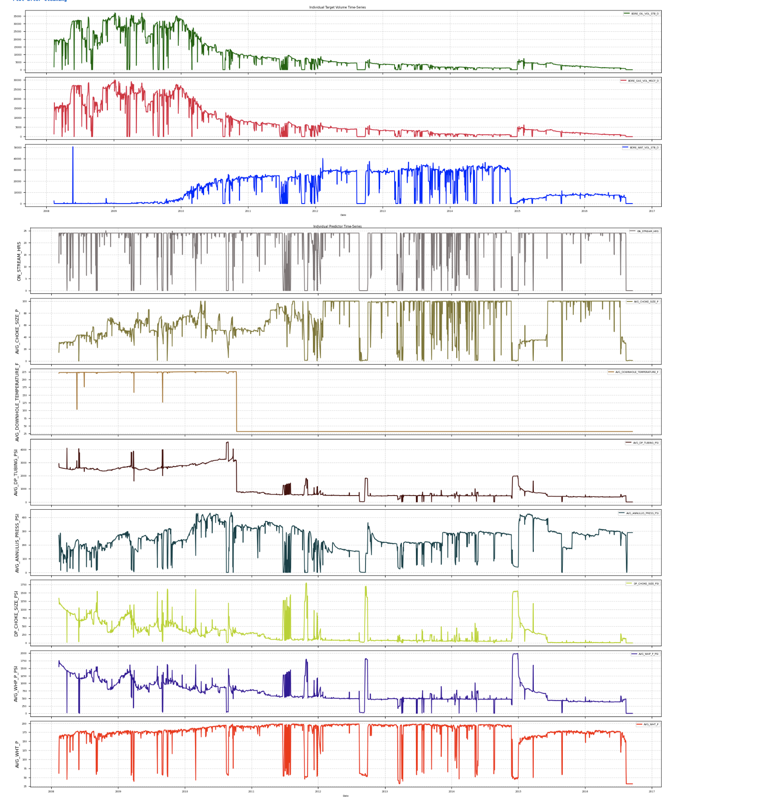 
  <i>Figure 1: Time-series plot of pressure, temperature, and fluid volumes for Well 3.</i>

## STL Decomposition, ACF, PACF, and Stationarity
STL decomposition was applied to separate the oil-rate time series into trend, seasonal, and residual components.

  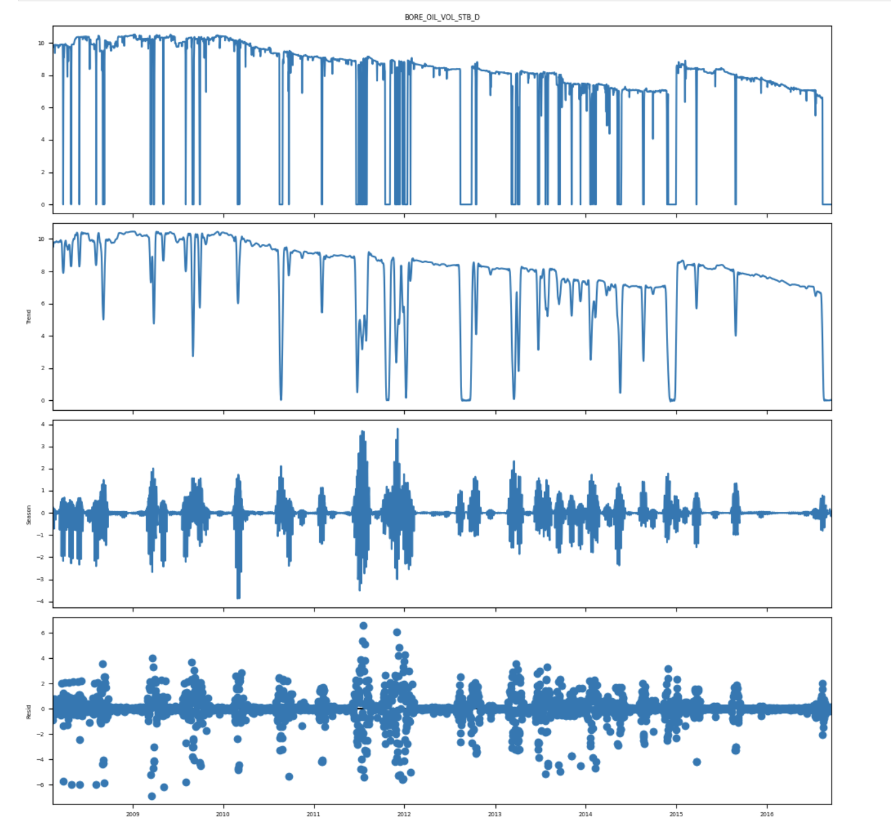 
  <i>Figure 2: STL Decompostion for Well 3.</i>

The trend component captures the overall long-term decline but is repeatedly interrupted by shut-ins, restarts, and changes in production regime. Unlike Well 1, Well 3 does not exhibit a stable or repeating seasonal pattern. The magnitude and timing of the seasonal component change throughout the production history, suggesting that much of the apparent seasonality is associated with operational events rather than a consistent calendar-driven process.

The residual component also displays periods of changing variance. Some intervals contain relatively small residuals, while others contain large positive and negative deviations. This indicates heteroscedasticity and suggests that forecast uncertainty is not constant over time.

  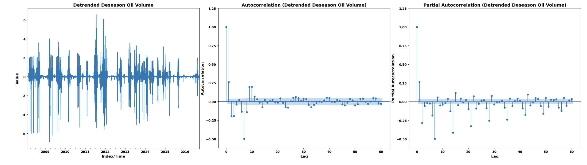 
  <i>Figure 3: STL Decompostion for Well 3.</i>

The residual ACF and PACF plots contain several statistically significant spikes. This shows that temporal dependence remains even after removing the estimated trend and seasonal components. In particular, the strong short-lag correlations indicate that recent production history remains useful for forecasting, while the additional significant lags suggest more complex operating cycles and delayed effects.

The residual series also contains structural changes and periods of substantially different variance. Therefore, the process cannot be considered fully stationary after STL decomposition. This is important because many forecasting methods assume that the relationship learned during training remains reasonably stable in the future.

Overall, the exploratory analysis identifies four major forecasting challenges:
| Challenge                                                      | Modeling implication                                                 |
| -------------------------------------------------------------- | -------------------------------------------------------------------- |
| Long-term decline interrupted by production increases          | A single decline trend may not extrapolate reliably                  |
| Frequent shut-ins and restarts                                 | Recursive predictions can accumulate errors during transitions       |
| Changing water-production regime                               | Relationships learned before 2015 may not represent later behavior   |
| Weak and inconsistent relationship with operating measurements | Sensor features may not fully explain changes in phase rates         |
| Remaining residual autocorrelation                             | Lagged production features are still required                        |
| Changing residual variance                                     | Forecast errors may be much larger during unstable operating periods |

For these reasons, Well 3 is expected to be more difficult to forecast than Well 1. The recursive models must reproduce not only the underlying production decline but also abrupt operational changes and structural shifts that are not fully explained by the available independent variables.

## Recursive Model
### Result on Validation Dataset

  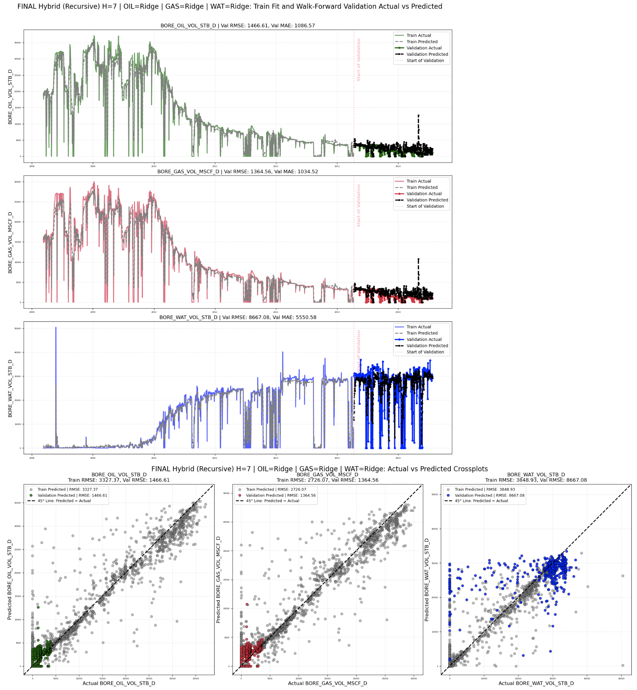 
  <i>Figure 4: Best performing recursive models for well 3. 7 days horizon.</i> 

  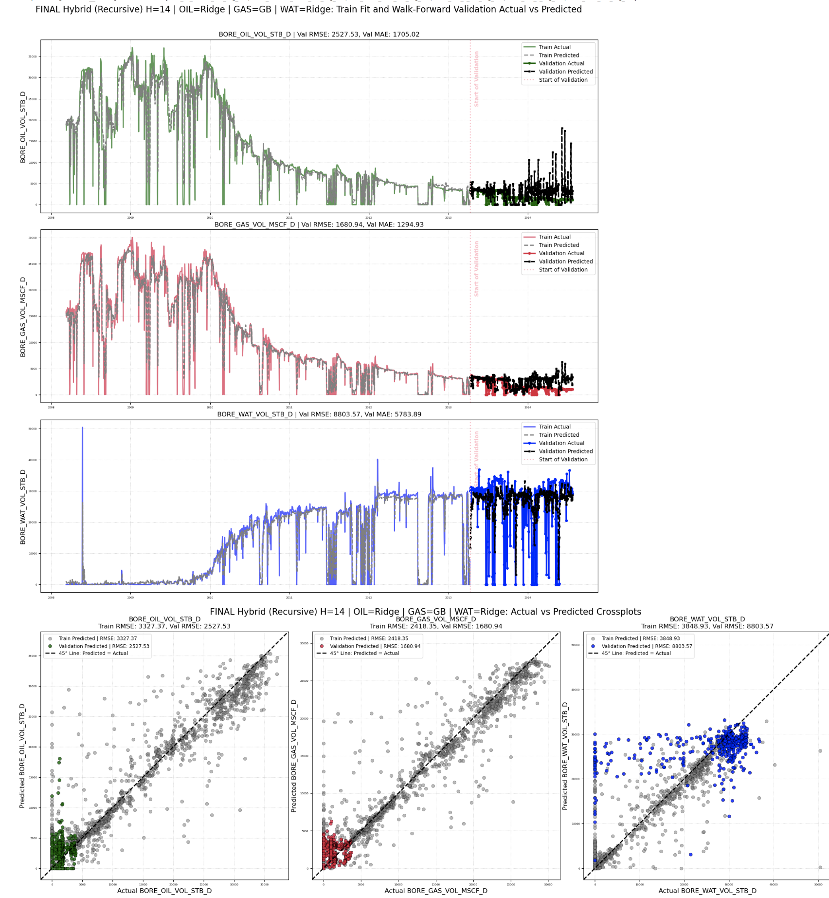 
  <i>Figure 5: Best performing recursive models for well 3. 14 days horizon.</i> 

  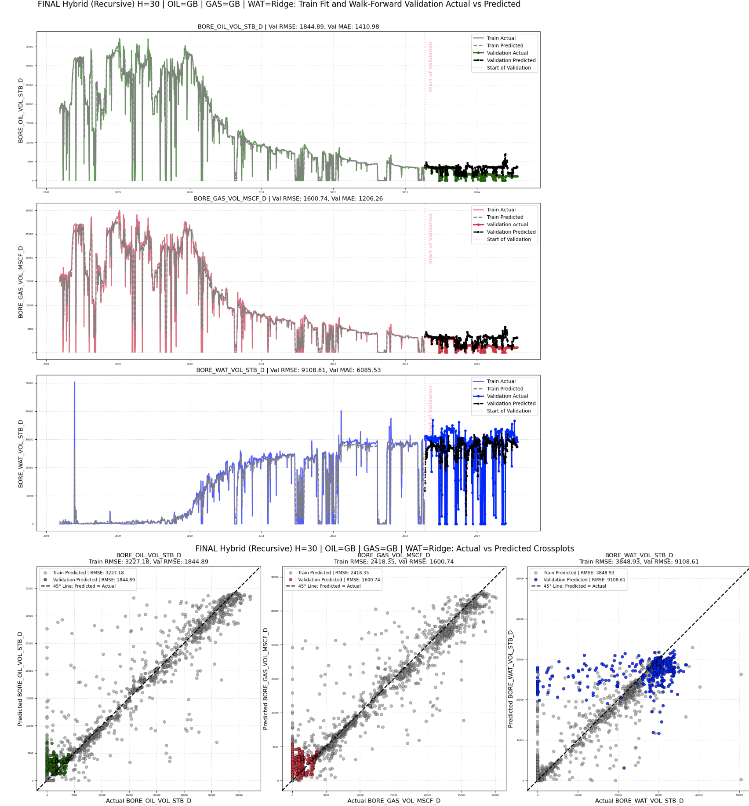 
  <i>Figure 6: Best performing recursive models for well 3. 30 days horizon.</i> 

The best-performing model family varied by production phase and forecast horizon.

| Horizon | Oil model         |     Oil RMSE | Gas model         |     Gas RMSE | Water model |   Water RMSE |
| ------- | ----------------- | -----------: | ----------------- | -----------: | ----------- | -----------: |
| 7 days  | Ridge             | **1,466.61** | Ridge             | **1,364.56** | Ridge       | **8,667.08** |
| 14 days | Ridge             |     2,527.53 | Gradient Boosting |     1,680.94 | Ridge       |     8,803.57 |
| 30 days | Gradient Boosting |     1,844.89 | Gradient Boosting |     1,600.74 | Ridge       |     9,108.61 |

The **7-day Ridge models produced the lowest overall errors**, showing that shorter recursive horizons reduced error accumulation. At longer horizons, Gradient Boosting performed better for oil and gas, while Ridge remained the strongest option for water.

The time plots show that the models captured the general low-rate production regime during validation but struggled with sudden shut-ins, restarts, and short-term rate fluctuations. Water remained the most difficult phase, with substantial scatter and persistent underprediction of extreme changes.

A major source of forecast error occurred after the abrupt decline in oil and gas production around mid-2013. This change represents a structural break in the well’s behavior rather than a normal short-term fluctuation. Because the models were trained mainly on the earlier, higher-rate production regime, they struggled to adjust to the new lower-rate conditions and frequently overpredicted production. The weak correspondence between this decline and the available operating measurements made the shift particularly difficult to identify. Recursive forecasting further amplified the problem because predictions based on the previous regime were reused as inputs for subsequent forecast steps.

Overall, the results confirm that Well 3 is considerably more difficult to forecast than Well 1 because of its structural production changes and weak relationship between the target rates and the available operating measurements.

### Result on Test Dataset

  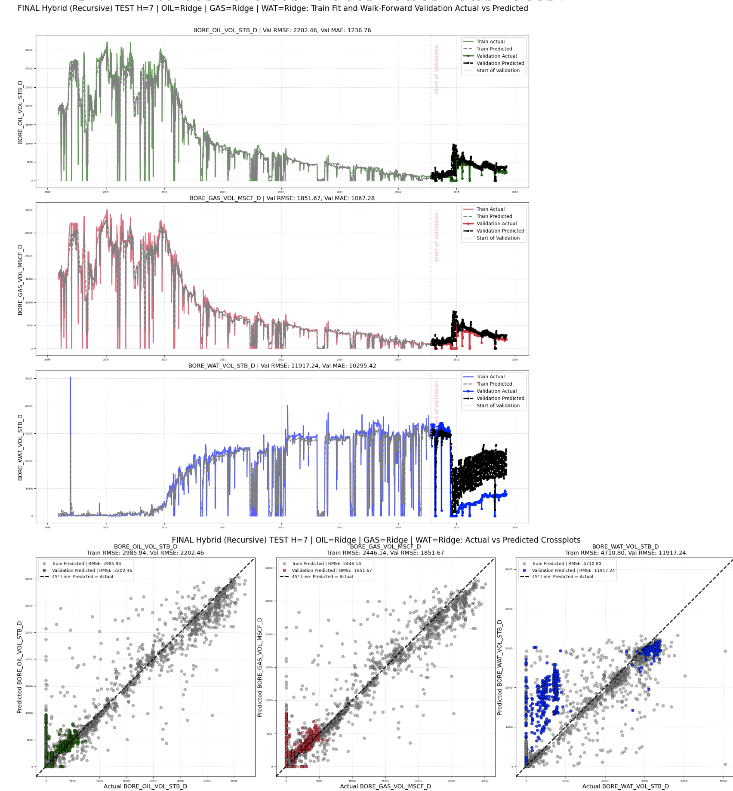 
  <i>Figure 7: Best performing recursive models for well 3. 7 days horizon</i> 

  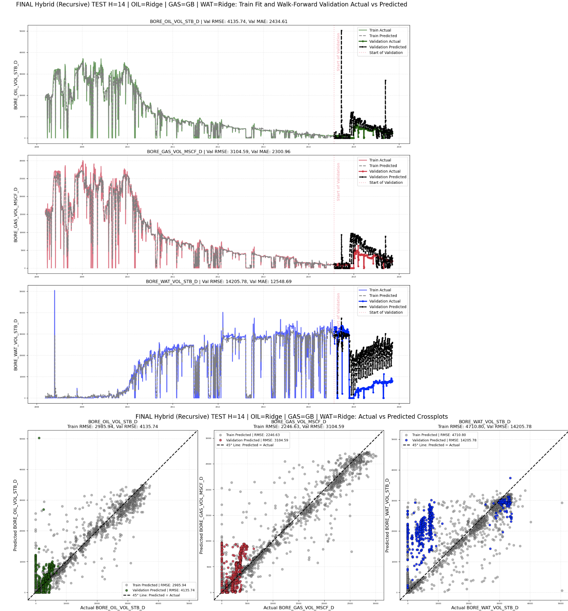> 
  <i>Figure 8: Best performing recursive models for well 3. 14 days horizon</i> 

  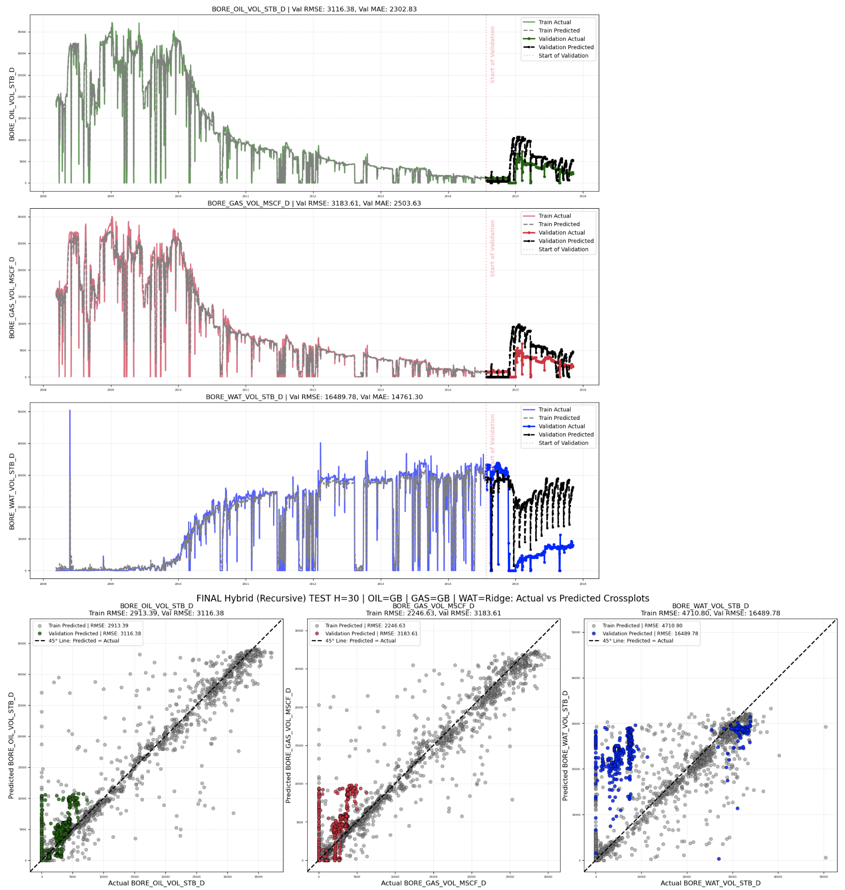 
  <i>Figure 9: Best performing recursive models for well 3. 30 days horizon</i> 

The recursive models performed poorly on the unseen test period, particularly for water and at the longer forecast horizons. The main reason was a major **regime change** near the beginning of the test period: oil and gas increased abruptly, while water production dropped to a much lower level.

These conditions were not well represented in the earlier training data. As a result, the models continued forecasting relationships learned from the previous regime:

* oil and gas forecasts failed to adjust accurately to the sudden production increase;
* water was substantially overpredicted because the model expected the earlier high-water-rate behavior to continue;
* shut-ins and rapid operational transitions were not reproduced consistently;
* recursive errors accumulated because each inaccurate prediction was reused to generate later lag features.

The problem became more severe as the horizon increased from 7 to 30 days. The 7-day models showed the least drift, while the 14- and 30-day forecasts produced increasingly biased and unstable production profiles.

Overall, the poor test performance indicates that Well 3 experienced a structural change that could not be explained adequately by the available operating variables. The relationships learned from the historical data were therefore no longer valid during the final test period, causing the recursive models to fail despite performing reasonably during validation.

A direct forecasting approach may perform better for Well 3 because it predicts each future horizon independently rather than feeding earlier predictions back into the model. This would reduce recursive error accumulation and prevent early mistakes from propagating through the full forecast window.

## Direct Forecast Model
Because the recursive models (day 14 & 30 horizons) performed poorly after the structural change in Well 3, a direct forecasting strategy was also evaluated. The main purpose of the direct approach is to remove the repeated feedback of predicted production rates into subsequent forecast steps.

In recursive forecasting, the one-day-ahead model is repeatedly applied:

$$
\hat{y}_{t+1}=f(\mathbf{X}_t)
$$

$$
\hat{y}*{t+2}=f(\hat{y}*{t+1},\mathbf{X}_{t+1})
$$

$$
\hat{y}*{t+3}=f(\hat{y}*{t+2},\mathbf{X}_{t+2})
$$

An error made at the beginning of the forecast therefore becomes an input to the following prediction. Over a long horizon, these errors can accumulate and cause substantial drift.

The direct approach instead trains a separate model for every forecast lead time:

$$
\hat{y}_{t+1}=f_1(\mathbf{X}_t)
$$

$$
\hat{y}_{t+2}=f_2(\mathbf{X}_t)
$$

$$
\vdots
$$

$$
\hat{y}*{t+30}=f*{30}(\mathbf{X}_t)
$$

Each model predicts its assigned future day directly from information available at the forecast origin. The predicted value for day 1 is therefore not used to produce the prediction for day 2.

#### Direct Forecast Output

For a 30-day forecast, the models produce the complete future production profile at once:

$$
\hat{\mathbf{y}}_{t+1:t+30} = \left[ \hat{y}_{t+1},\, \hat{y}_{t+2},\, \ldots,\, \hat{y}_{t+30} \right]
$$

Because oil, gas, and water are modeled independently, the full system may contain up to:

$$
30 \text{ lead models} \times 3 \text{ phases} = 90 \text{ individual models}
$$

This increases the number of models that must be trained and maintained, but it also allows each phase and forecast lead to use the model family that performs best.

#### Construction of the Direct Training Dataset

For each forecast lead $h$, the target is shifted backward by $h$ days:

$$
y_t^{(h)}=y_{t+h}
$$

For example, the training table for the 7-day-ahead oil model would be constructed as follows:

| Forecast origin |        Available oil lag | Available operating features    |        Target |
| --------------- | -----------------------: | ------------------------------- | ------------: |
| Day 1           | Oil at day 1 and earlier | Measurements available by day 1 |  Oil at day 8 |
| Day 2           | Oil at day 2 and earlier | Measurements available by day 2 |  Oil at day 9 |
| Day 3           | Oil at day 3 and earlier | Measurements available by day 3 | Oil at day 10 |

A separate table is created for each lead from 1 to 30 days. Longer lead models contain slightly fewer training rows because the final observations do not have corresponding future targets.

#### Feature Availability

Feature availability is especially important in direct forecasting. When the complete 30-day forecast is generated on day $t$, actual operating measurements for days $t+1$ through $t+30$ are not yet known.

Therefore, the direct models should use:

* historical production lags available at the forecast origin;
* historical operating measurements;
* rolling and expanding summaries calculated through day $t$;
* calendar variables;
* planned choke settings;
* planned shut-ins or operating schedules;
* other variables genuinely known for the future horizon.

The model must not use the actual future pressure, temperature, choke, or on-stream measurements unless those variables are known in advance.

The direct model can be written as:

$$
\hat{y}_{t+h}
$$

$$
f_h \left( \mathbf{y}_{t:t-p},\, \mathbf{X}_{t:t-p},\, \mathbf{X}_{t+h}^{\text{known}} \right)
$$

where:

* $\mathbf{y}_{t:t-p}$ represents historical production lags;
* $\mathbf{X}_{t:t-p}$ represents historical operating measurements;
* $\mathbf{X}_{t+h}^{\text{known}}$ represents future variables that are known or planned.

#### Static and Updated Direct Forecasts

Two direct deployment configurations are possible.

#### Static 30-Day Forecast

A complete 30-day forecast is generated immediately after the latest separator measurement. The forecast remains unchanged until the next separator test.

This method requires only information available at the beginning of the forecast period. It is operationally simple but cannot react to unexpected changes during the month.

#### Daily-Updated Direct Forecast

The model can also generate a new 30-day forecast each day using the latest available sensor measurements. The actual oil, gas, and water rates are still not required, but pressure, temperature, choke, and on-stream measurements can be updated daily.

This approach may be more appropriate for Well 3:

$$
\hat{\mathbf{y}}_{t+1:t+30} = F(\mathbf{X}_t)
$$

On the following day, the forecast is refreshed:

$$
\hat{\mathbf{y}}_{t+2:t+31} = F(\mathbf{X}_{t+1})
$$

This rolling direct forecast may respond more quickly to operational changes without recursively feeding predicted production rates back into the model. This is the approach implemented in here.

#### Potential Advantages for Well 3

The direct approach may improve performance for Well 3 for several reasons.

First, it eliminates recursive error propagation. An inaccurate prediction for day 1 does not affect days 2 through 30.

Second, each lead model can learn a different relationship. Short-term models may rely strongly on recent production lags, while longer-term models may place more importance on decline trends, calendar variables, and operating conditions.

Third, direct predictions are generally less likely to drift or explode because predicted target values are not repeatedly reused as model inputs.

Finally, the direct approach may handle the abrupt production change more effectively when the change is reflected in the available operating measurements. A daily-updated direct forecast could use new sensor information to revise the expected production profile without waiting for the next separator measurement.

#### Limitations

Direct forecasting does not automatically solve the structural-break problem. If the abrupt increase in oil and gas and the decline in water are not reflected in the available sensor or operating variables, the model will still have no information indicating that the production regime has changed.

The direct approach also has several practical disadvantages:

| Limitation                         | Effect                                                                |
| ---------------------------------- | --------------------------------------------------------------------- |
| Separate model for every lead      | More models must be trained and maintained                            |
| Fewer observations at longer leads | The 30-day model has less training data                               |
| Independent lead predictions       | The 30-day profile may be irregular or internally inconsistent        |
| Unknown future operating variables | Future measurements must be excluded, planned, or forecast separately |
| Structural breaks                  | Unseen production regimes may still cause large errors                |

Because the lead models are independent, the predicted daily profile may occasionally contain unrealistic jumps. Post-processing, smoothing, phase constraints, or physically informed limits may therefore be required.

#### Evaluation Strategy

The direct models should be evaluated using the same chronological training, validation, and test periods used for the recursive models.

At every forecast origin, all 30 predictions are generated without using any actual target values from within the forecast window. Performance should then be evaluated:

* separately for each lead day;
* across the complete 30-day horizon;
* using RMSE, MAE, and $R^2$;
* through time-series plots;
* by examining cumulative production error;
* during shut-ins, restarts, and regime changes.

A lead-time error plot is particularly useful:

$$
\text{RMSE}(h),
\qquad
h=1,2,\ldots,30
$$

This shows whether forecast accuracy deteriorates gradually or whether specific lead times are especially difficult.

#### Expected Outcome

For Well 3, direct forecasting is worth testing because the recursive models suffered from substantial error accumulation after the production regime changed. The direct approach should produce more stable long-horizon forecasts because each future day is predicted independently.

However, the direct model will only improve the structural-break problem when the available operating features contain information about the new production regime. The comparison between direct and recursive forecasting will therefore determine whether Well 3’s poor performance is mainly caused by recursive error propagation or by insufficient explanatory information in the dataset.

### Results on Validation Data
For all the models evaluated for the direct model, Ridge regression was consistenly the best among all horizons. 

  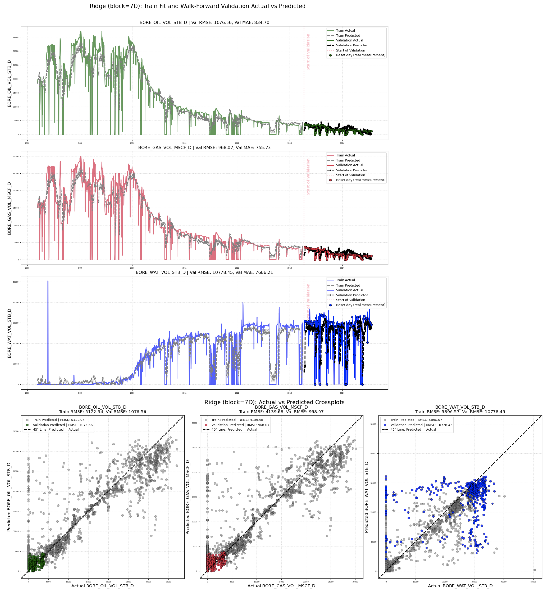 
  <i>Figure 10: Best performing direct models for well 3. 7 days horizon</i> 

   
  <i>Figure 11: Best performing direct models for well 3. 14 days horizon</i> 

  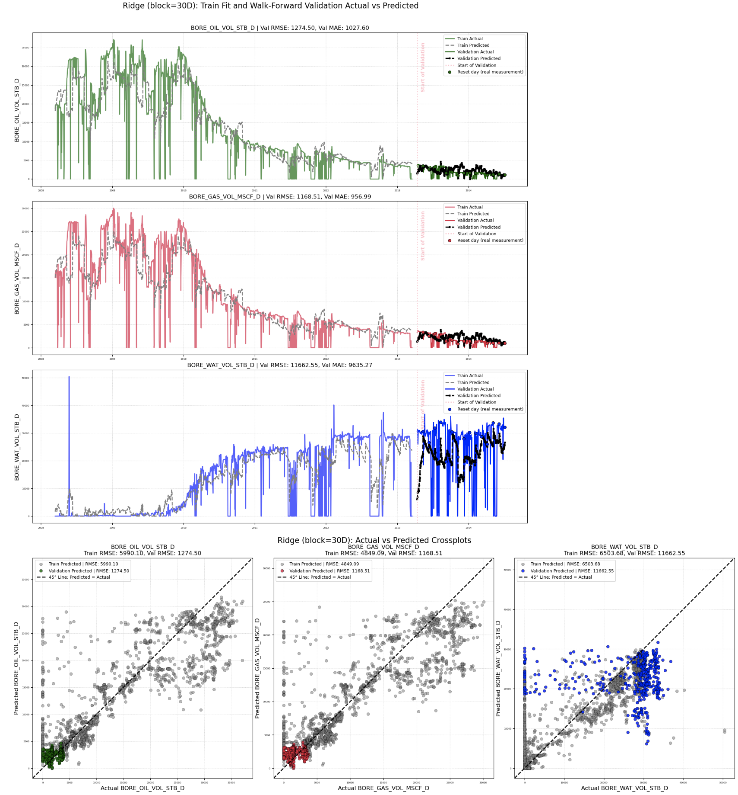 
  <i>Figure 12: Best performing direct models for well 3. 30 days horizon</i> 

Out of all the models evaluated, the Ridge direct-forecast models were the best. The one-day model serves as the short-term benchmark, while the longer horizons represent increasingly less frequent separator measurements.

### Model Performance

| Model | Block horizon | Phase | Train RMSE | Train MAE | Train R² | Val daily RMSE | Val daily MAE | Val daily R² | Val end-of-block RMSE | Val end-of-block MAE | Val end-of-block R² |
| ----- | ------------: | ----- | ---------: | --------: | -------: | -------------: | ------------: | -----------: | --------------------: | -------------------: | ------------------: |
| Ridge |             1 | Oil   |   4,497.00 |  2,540.33 |    0.838 |         937.12 |        685.02 |        0.239 |                937.12 |               685.02 |               0.239 |
| Ridge |             1 | Gas   |   3,641.24 |  2,088.10 |    0.830 |         825.95 |        603.07 |        0.337 |                825.95 |               603.07 |               0.337 |
| Ridge |             1 | Water |   4,990.47 |  2,557.67 |    0.828 |       8,982.85 |      6,067.48 |        0.160 |              8,982.85 |             6,067.48 |               0.160 |
| Ridge |             7 | Oil   |   5,122.94 |  3,097.64 |    0.790 |       1,076.56 |        834.70 |       -0.003 |              1,104.68 |               898.49 |              -0.089 |
| Ridge |             7 | Gas   |   4,139.68 |  2,528.43 |    0.779 |         968.07 |        755.73 |        0.090 |                981.85 |               803.66 |               0.042 |
| Ridge |             7 | Water |   5,896.57 |  3,274.15 |    0.760 |      10,778.45 |      7,666.21 |       -0.207 |             10,457.54 |             7,818.89 |              -0.214 |
| Ridge |            14 | Oil   |   5,266.83 |  3,281.92 |    0.778 |       1,303.05 |      1,036.95 |       -0.455 |              1,625.04 |             1,368.93 |              -1.257 |
| Ridge |            14 | Gas   |   4,266.32 |  2,683.49 |    0.766 |       1,188.29 |        951.42 |       -0.358 |              1,439.27 |             1,203.57 |              -0.917 |
| Ridge |            14 | Water |   6,519.10 |  3,804.59 |    0.707 |      12,106.02 |      9,123.28 |       -0.503 |             12,394.83 |             9,855.98 |              -0.728 |
| Ridge |            30 | Oil   |   5,990.10 |  3,978.40 |    0.711 |       1,274.50 |      1,027.60 |       -0.368 |              1,124.50 |               857.18 |              -0.793 |
| Ridge |            30 | Gas   |   4,849.09 |  3,229.42 |    0.696 |       1,168.51 |        956.99 |       -0.293 |                986.16 |               785.37 |              -0.481 |
| Ridge |            30 | Water |   6,503.68 |  4,121.93 |    0.708 |      11,662.55 |      9,635.27 |       -0.370 |              8,565.57 |             7,372.24 |              -3.410 |

### Interpretation of the Errors

MAE represents the average absolute difference between the predicted and measured production rates. RMSE is expressed in the same units as the target but gives greater weight to occasional large errors. A large difference between RMSE and MAE therefore indicates that the model made some unusually large mistakes. 

RMSE is scale-dependent and should not be interpreted using a universal threshold. Its magnitude depends on the magnitude and variability of the production rate being predicted. It should be compared with the target distribution, a naive baseline, the standard deviation, and the operational tolerance for forecast error. 

Oil and gas production are much lower during validation than during the earlier training period. Because the production rates are declining, the absolute magnitude of their errors also tends to decline. This partly explains why the oil and gas validation RMSE values are much lower than their training RMSE values. It does not necessarily mean that the model predicts the validation period proportionally better.

Water shows the opposite behavior. Water production rises into a higher-rate regime during the later period, so the magnitude of its absolute forecast errors increases. The change in water-production behavior also differs considerably from the historical relationships learned during training, which contributes to the much larger validation RMSE and MAE.

The negative validation (R^2) values at the longer horizons indicate that, relative to the variability of the validation period, the models performed worse than simply predicting the validation mean. This can occur even when the absolute RMSE appears lower than the training RMSE because the validation oil and gas rates occupy a much smaller and narrower production range.

### Daily and End-of-Block Errors

The daily metrics evaluate every prediction within each forecast block. The end-of-block metrics evaluate only the final forecast day before the model is reset with a new physical measurement.

End-of-block performance is important because it represents the point at which the model has gone the longest without receiving an updated production measurement. However, these metrics are calculated from fewer observations and can therefore be more sensitive to individual production changes.

### Gap Between Training and Validation
**Training data (fixed, invisible in the plot)**. To build a training example the target must exist H days after the anchor. The last H days of the training period have no such target — those days fall in validation — so they are dropped from the fit. Each model therefore never learns from its final H days of training, and the loss grows with the horizon (7, 14, 30 days). This changes what the model learns but does not appear as a gap in the time plot.
The visible gap between the training predictions and the start of validation is a consequence of direct-target construction.

$$
y_t^{(h)}=y_{t+h},
\qquad h=1,\ldots,H
$$

The final (H) days of the training period cannot be used because their targets fall inside the validation period. Therefore, the training predictions end:

* 7 days early for the 7-day model;
* 14 days early for the 14-day model;
* 30 days early for the 30-day model.

This is a major disadvantage of direct forecasting. As the horizon increases, the model loses more of the most recent training observations, even though these observations may best represent the well’s current operating regime.

### Boundary Effects in the Direct Walk-Forward Model

Two independent effects occur at a split boundary. They are easy to conflate because both sit at the seam, but they act on entirely different objects and have different sizes.

#### 1. Data Availability: Which Rows Each Split Can Actually Use

A direct $H$-day model needs, for every anchor date $t$:
* **Lag features** looking backward (here, up to ~30 days)
* **A target** looking forward $H$ days (the value at $t+H$)

An anchor is usable only if both exist. Because the feature/target tables for validation, test, and keep are built over the full dataset, their lags and targets can reach across boundaries into the neighboring split. Only the true ends of the dataset—and one deliberate exception—actually lose rows:

| Split | Loses at Start (Lag Lookback) | Loses at End (Target Lookahead) |
| :--- | :--- | :--- |
| **Train** | **Yes** — dataset's true beginning, nothing before it | **Yes** (by choice, not forced) — could reach into validation, but deliberately doesn't |
| **Validation** | **No** — reaches back into training | **No** — reaches forward into test |
| **Test** | **No** — reaches back into validation | **No** — reaches forward into keep |
| **Keep** | **No** — reaches back into test | **Yes** — dataset's true end, nothing after it |

##### How to Read This Table:
* **Forced losses** happen only at the two true ends of the dataset: the start of training (no history before it) and the end of keep (no future after it). 
* **Internal seams** can reach across split boundaries and lose nothing—except for the end of the training set, which is cut on purpose.

##### Why the training end is the exception (The Real Cost of Direct Forecasting):
The training table is built on training data alone, not the full dataset. If it used the full dataset, the last $H$ training anchors would pull their targets from the validation period. While these are real values, they act as validation labels; fitting a model on them introduces data leakage. 

To keep the boundaries clean, the training set deliberately drops its last $H$ days. The consequence is a genuine disadvantage of the direct approach: right at the critical seam, the longer the horizon, the more recent (and most regime-relevant) data the model never learns from. This alters what each model learns, but it is **not** the physical gap you see in the time-series plots.

#### 2. The Visible Seam Gap: How Far the Drawn Line Reaches

The predictions are drawn using a block walk-forward simulation. From a fixed origin date, the simulation advances in blocks of block_horizon days, forecasting each day in a block from that block's anchor point. 

Because only complete blocks are simulated, the drawn line stops at the last full block boundary before the split. The final partial block is left blank. Its width is a function of pure calendar alignment:

$$
\text{gap} = (\text{boundary date} - \text{grid origin}) \pmod{\text{block\_horizon}}
$$

where:
$$
0 \le \text{gap} \le \text{block\_horizon} - 1
$$

For the 30-day blocks used here, that results in a gap of **23 days** at the training $\rightarrow$ validation seam, and **6 days** at the training + validation $\rightarrow$ test seam. Both runs share the exact same block grid; the test seam gap is smaller only because adding the validation period shifts the alignment so the seam happens to land closer to a block boundary. 

This is a plotting/segmentation artifact, not a structural loss of usable data—the partial block could easily be simulated to close it.

#### 3 Reconciling the Two Mechanisms

While both boundary effects arise from using a fixed horizon, they are driven by entirely separate mechanisms:

| Effect Name | What It Acts On | Size | Visible in Time Plot? |
| :--- | :--- | :--- | :--- |
| **Data Cutoff (1)** | Training rows | Exactly $H$ (30 days) | **No** — silently changes what the model learns |
| **Seam Gap (2)** | The drawn forecast line | $0$ to $H-1$ (here: 23 / 6) | **Yes** — this is the physical gap seen |

These mechanisms are completely independent. One could simulate the last partial block and close the visible gap without touching the training data cutoff, and vice versa. This explains exactly why the true structural data cutoff remains a constant 30 days, while the cosmetic seam gap between the validation time plots and the test time plots.

---
### Deployment Decision

The one-day model produced the lowest errors, but it would require a new separator measurement every day and therefore would not provide a practical virtual-metering solution.

The 7-day model produced the best results among the multi-day forecasts but would still require weekly physical measurements. The 14-day model did not provide a clear performance advantage over the 30-day model.

| Horizon | Oil daily RMSE | Gas daily RMSE | Water daily RMSE | Approximate measurement frequency |
| ------: | -------------: | -------------: | ---------------: | --------------------------------- |
|   1 day |     **937.12** |     **825.95** |     **8,982.85** | Daily                             |
|  7 days |       1,076.56 |         968.07 |        10,778.45 | Weekly                            |
| 14 days |       1,303.05 |       1,188.29 |        12,106.02 | Twice monthly                     |
| 30 days |       1,274.50 |       1,168.51 |        11,662.55 | Monthly                           |

The **30-day direct horizon is therefore selected for deployment**. Compared with the 7-day model, its daily RMSE is approximately:

* 18% higher for oil;
* 21% higher for gas;
* 8% higher for water.

This moderate loss in accuracy is accepted in exchange for reducing the required separator-measurement frequency from weekly to monthly. However, the weak and negative validation (R^2) values—particularly for water—show that the forecasts should be treated as uncertain estimates rather than reliable replacements for all physical measurements.

The final deployment should therefore combine the monthly direct forecast with production limits, residual monitoring, cumulative-volume checks, and an early reset whenever operating conditions indicate that the well has entered a new production regime.

---
### Results on Test Data

  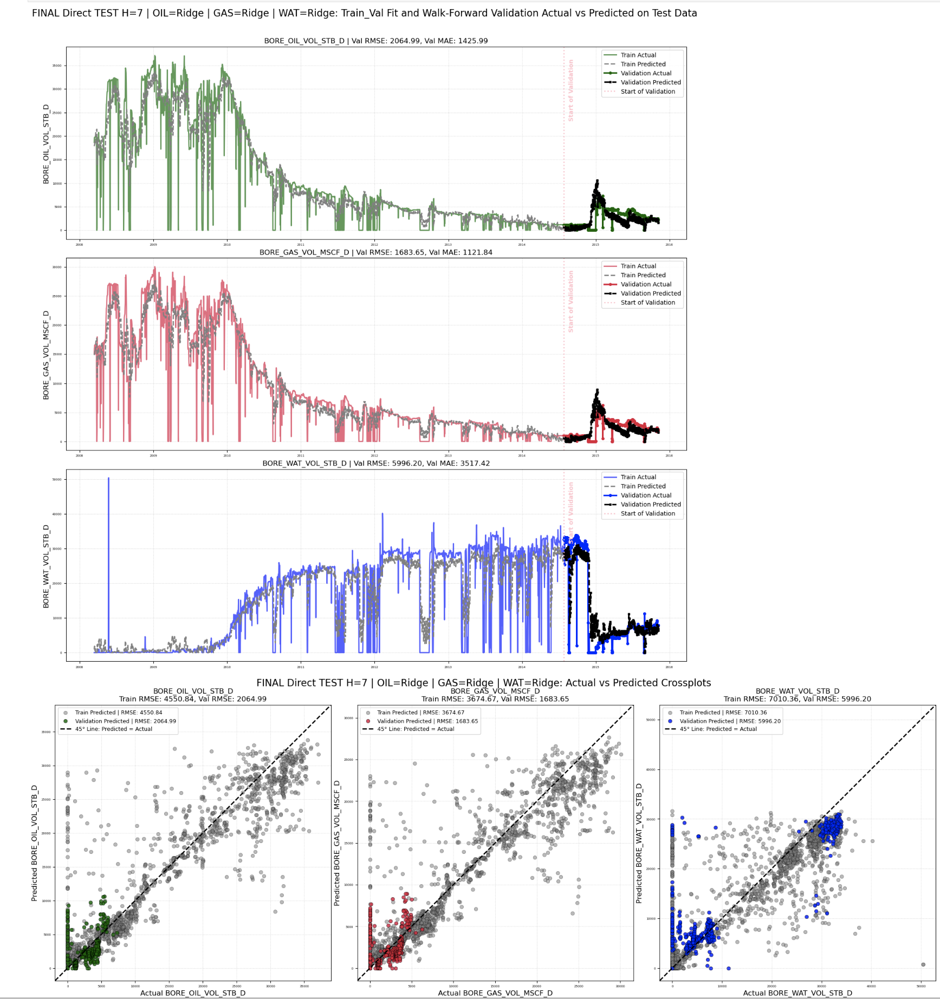 
  <i>Figure 13: Best performing direct models on test data for well 3. 7 days horizon</i> 

  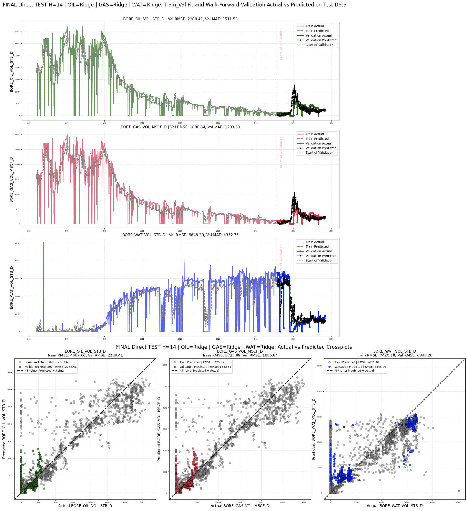 
  <i>Figure 14: Best performing direct models on test data for well 3. 14 days horizon</i> 

  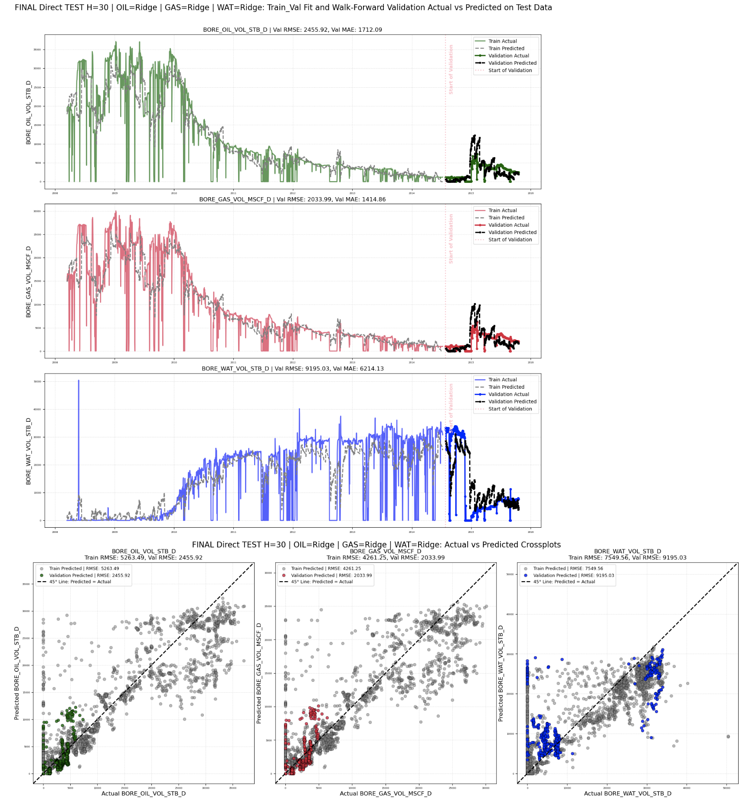 
  <i>Figure 15: Best performing direct models on test data for well 3. 30 days horizon</i> 

The direct Ridge models outperformed the recursive models for all three production phases and at every forecast horizon.

| Horizon | Phase |  Direct RMSE | Recursive RMSE | Improvement |
| ------: | ----- | -----------: | -------------: | ----------: |
|  7 days | Oil   | **2,064.99** |       2,202.46 |        6.2% |
|  7 days | Gas   | **1,683.65** |       1,851.67 |        9.1% |
|  7 days | Water | **5,996.20** |      11,917.24 |       49.7% |
| 14 days | Oil   | **2,288.41** |       4,135.74 |       44.7% |
| 14 days | Gas   | **1,880.84** |       3,104.59 |       39.4% |
| 14 days | Water | **6,848.20** |      14,205.78 |       51.8% |
| 30 days | Oil   | **2,455.92** |       3,116.38 |       21.2% |
| 30 days | Gas   | **2,033.99** |       3,183.61 |       36.1% |
| 30 days | Water | **9,195.03** |      16,489.78 |       44.2% |

The improvement is especially large for water and at the longer horizons. Unlike recursive forecasting, the direct models do not feed earlier predictions back into later forecast steps, so errors do not accumulate through the forecast block.

The direct models also responded better to the abrupt increase in oil and gas and the sharp decrease in water near the start of the test period. However, the time plots show that they still struggled to reproduce the exact magnitude and timing of this regime change. This confirms that direct forecasting reduced error propagation, but it could not fully overcome the structural break and the limited information contained in the operating measurements.

Overall, the direct approach is more suitable for Well 3 than the recursive approach, with the **30-day direct model offering the best operational balance between forecast accuracy and monthly measurement frequency**.
