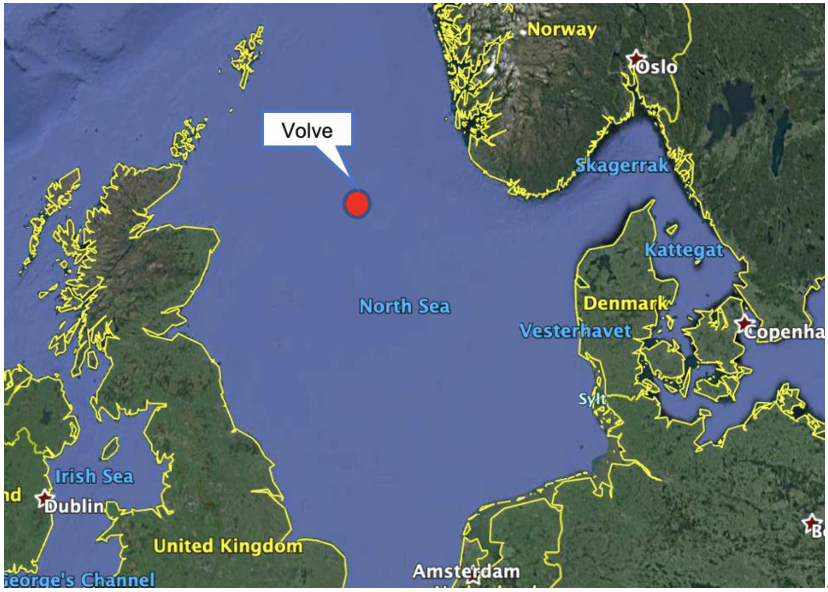
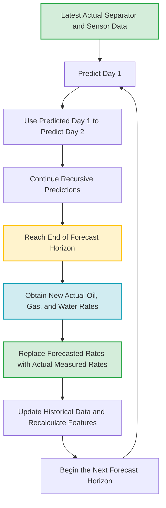
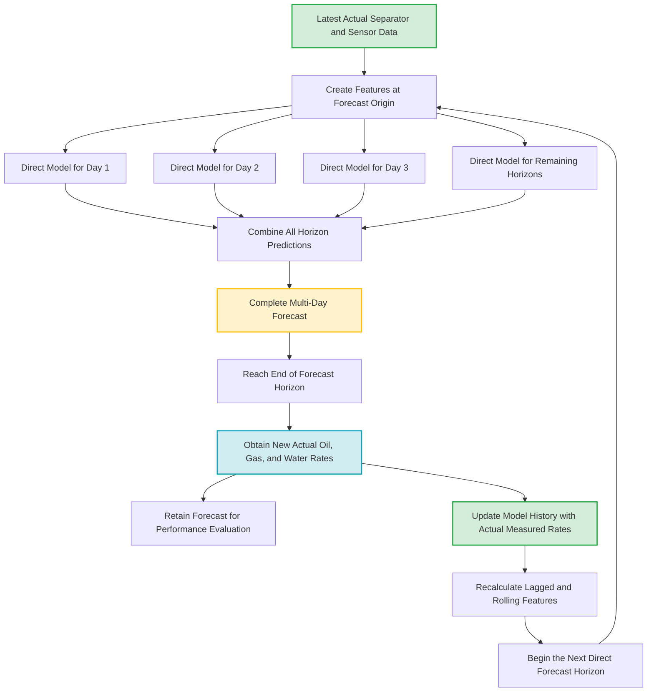
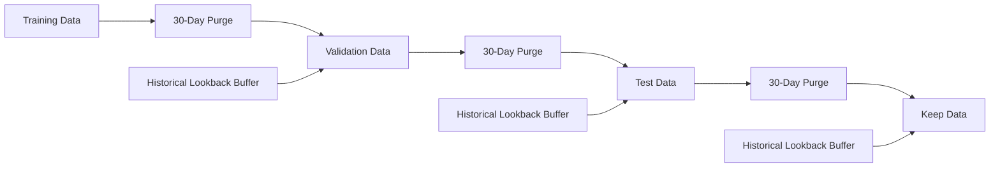

# Volve Reservoir Virtual Meter

The Volve oil field is located in Block 15/9 of the central Norwegian North Sea. It is situated approximately 200 kilometers west of Stavanger, Norway,and in a water depth of around 80 meters. The Volve field produced oil and gas from 2008 to 2016 and is now decommissioned, but it remains as one of the most open-source subsurface and production datasets in the energy industry. The aim of this project is to come up with different ways to visualize the production data and perform decline curve analysis. 

<figure>

<figcaption>Source: <a href="https://encrypted-tbn0.gstatic.com/images?q=tbn:ANd9GcT7ex3O5HJRM-omJ3P_GW9B6RS3xKcMWQPhJA&s">Picture of Volve field</a></figcaption>
</figure>


## Project Motivation
Accurate measurement of oil, gas, and water production is essential for production optimization, reservoir management, production allocation, and well-performance surveillance. However, installing dedicated multiphase flow meters on every well is often economically impractical, particularly in fields containing many producing wells.

In current operations, individual well production may be estimated using periodic separator tests, shared test facilities, and flowback-allocation methods. Measured facility-level production is allocated back to individual wells using the most recent well-test results, historical production ratios, operating conditions, or engineering assumptions. Although this approach is widely used, the allocated rates may become less representative between well tests, especially when well performance, choke settings, pressures, water cut, gas–oil ratio, or operating status change.

This project investigates the development of a machine-learning-based virtual flow meter that uses routinely available well measurements, including wellhead pressure, choke size, temperature, on-stream hours, and historical production data, to estimate daily oil, gas, and water rates.

The proposed system is intended to complement the existing flowback-allocation process by providing more frequent, well-specific phase-rate estimates between physical well tests. This could improve production-allocation accuracy, reduce reliance on frequent separator testing, identify changes in well behavior earlier, and support faster production-management decisions.

The project also evaluates the model’s ability to forecast future production, recognize changing operating regimes, and maintain reliable performance as well and reservoir conditions evolve.

## Executive Summary


## Modules

- DF__1-15-9-F-1_C_Recursive.ipynb: Recurvsive Model for Well 15-9-F-1_C
- DF__2-15_9-F-11_Recursive.ipynb: Recursive Model for Well 15_9-F-11
- DF__2-15_9-F-11_Direct.ipynb: Direct Moodel for Well 15_9-F-11
- DF__3-15-9-F-12_Recursive.ipynb: Recursive Moodel for Well 15_9-F-12
- DF__3-15-9-F-12_Direct.ipynb: Direct Model for Well 15-9-F-12
- DF__4-15-9-F-14_Recursive.ipynb: Recursive Moodel for Well 15_9-F-14
- DF__4-15-9-F-14_Direct.ipynb: Direct Model for Well 15-9-F-14
- 1_Load_split_export_make_plots: Testing functions to split input data into individual wells and make time plots
- 2_Plot_Clean_dfs.ipynb: Testing function to clean data

## Project Structure
```text
├── assets
│   └── style.css
├── new-workspace.jupyterlab-workspace
├── notebooks
│   ├── 1_Load_Clean_Production_data.ipynb
│   ├── 2_Find_Load_plot_X_Y_loc.ipynb
│   ├── 3_Grid_properties.ipynb
│   ├── 4_decline_curve_analysis.ipynb
│   ├── Dash_Decline_Curve.ipynb
│   ├── Dash_Production.ipynb
│   ├── Dash_Well_Comparison.ipynb
│   └── temp-plot.html
├── README.md
├── src
│   ├── Decline_curve.py
│   ├── Find_Load_plot_X_Y_loc.py
│   ├── Load_clean_production_data.py
│   └── Load_Petrophysical_data.py
└── The-geographic-location-of-the-Volve-field.png
```

## Overall Workflow
### Why Time-Series Analysis is Diffent than other Machine Learning Applications

Time-series analysis is essential in virtual flow metering because oil, gas, and water production measurements are collected sequentially over time. In addition, the oil, gas and water are produced at the sametime A well’s current production rate is influenced by its previous production, pressure history, choke settings, operating hours, shutdowns, reservoir depletion, and other earlier operating conditions and reservoir conditions. Therefore, the order in which the observations occur contains valuable information that should not be ignored.

In many traditional machine-learning applications, observations are assumed to be largely independent and identically distributed. For example, when predicting house prices, the order in which houses appear in the dataset usually has no physical meaning. The data can often be randomly shuffled before being divided into training and testing sets.

Time-series data are different because observations are temporally dependent. Randomly shuffling production data would allow the model to learn from future well behavior when predicting the past, creating data leakage and producing unrealistically optimistic performance. Training, validation, and testing must therefore follow chronological order so that the model is evaluated under conditions that resemble real deployment.

Time-series analysis is also important because production data commonly contain several time-dependent patterns:

* **Trend:** Long-term increases or decreases caused by reservoir depletion, well cleanup, artificial-lift changes, or water breakthrough.
* **Seasonality or cyclic behavior:** Repeated patterns related to operating schedules, testing frequency, facility constraints, or periodic interventions.
* **Autocorrelation:** Current production is often strongly related to production during previous days.
* **Regime changes:** Shut-ins, choke changes, workovers, startup periods, unstable flow, and water breakthrough can cause the well to behave differently over time.
* **Nonstationarity:** The statistical distribution of production may change as the well and reservoir evolve.

These characteristics require specialized feature engineering, such as lagged production values, rolling averages, rolling slopes, cumulative production, time-since-start variables, and operating-regime indicators.

Time-series forecasting also introduces an additional challenge: the availability of future input variables. In a normal supervised-learning problem, all predictor variables are usually available when a prediction is made. In forecasting, future values of variables such as wellhead pressure, choke size, and on-stream hours may not yet be known. The model must therefore use historical values, planned operating conditions, separately forecasted variables, or recursive predictions.

Another important difference is how errors propagate. In a one-day-ahead prediction, the model can use the most recently measured production data. In a recursive 30-day forecast, the prediction for the first day may be used as an input for the second day, and subsequent predictions continue to depend on earlier predicted values. Small errors can therefore accumulate and cause the forecast to drift over longer horizons.

For virtual metering, time-series analysis makes it possible to:

1. Capture the natural production decline and changing behavior of the well.
2. Use recent production and operating history to improve phase-rate estimates.
3. Predict oil, gas, and water rates between separator tests.
4. Detect unusual behavior or operating conditions not represented in the historical data.
5. Evaluate the model realistically using chronological validation.
6. Update the model as new separator measurements and sensor data become available.

Consequently, virtual metering should not be treated as a conventional regression problem in which rows can be randomly shuffled. It is a dynamic forecasting problem in which time, operational history, data availability, and changes in well behavior must be explicitly considered.

### Model Type Architecture 
#### One Step (Day) Look Ahead
A one-step look-ahead model predicts the production rate for the next day using all information available up to the current day.

For example, at the end of Day 13, the model uses production history, sensor measurements, and operating conditions observed through Day 13 to predict the oil, gas, and water rates for Day 14.For day 15 prediction, the actual rates of day 14 is no avaliable, and the predicted rate for day 14 is now replaced by the actual real rates of day 14.


This is commonly called walk-forward one-step forecasting:

1. Predict the next day.
2. Observe the actual next-day value.
3. Add the actual value to the available history.
4. Recalculate the lagged and rolling features.
5. Predict the following day.

A variable can only be used for Day (t+1) if its value is genuinely available when the forecast is generated.

For example, at the end of Day 13:

* Day 13 WHP can be used to predict Day 14;
* Day 13 choke size can be used;
* a planned Day 14 choke setting can be used if it is known in advance.
* the actual Day 14 WHP cannot be used because it has not yet been measured;
* the actual Day 14 oil rate cannot be used because it is the prediction target.

$$
\hat{y}_{t+1} = f\left( y_t,\, \text{WHP}_t,\, \text{choke}_t,\, \text{on-stream hours}_t \right)
$$

It should not use future information that is unavailable when the prediction is made:

$$
\hat{y}_{t+1} \neq f\left( \text{actual WHP}_{t+1},\, \text{actual oil rate}_{t+1} \right)
$$

One-step forecasting is generally easier than forecasting several days ahead because the model always receives the latest actual production measurements.

For example:

    Day 13 actual data → predict Day 14
    Day 14 actual data → predict Day 15
    Day 15 actual data → predict Day 16

The model does not have to use its Day 14 prediction as an input for predicting Day 15. This reduces cumulative forecast error and drift. This different than the recursive. In comparison, a recursive multi-day forecast may operate as follows:

    Day 13 actual data       → predict Day 14
    Day 14 predicted value   → predict Day 15
    Day 15 predicted value   → predict Day 16

Errors from earlier predictions can therefore propagate through the forecast.

In virtual meters, the one step look ahead model architecture is not really useful, because we are going to need the actual separator measurements every  other everyday.

However, when separator measurements are only obtained every 30 days, a true daily one-step forecasting system cannot continually use the actual previous-day phase rates. After the first forecasted day, it must either:

* use its own predicted phase rates recursively;
* use a direct multi-horizon model;


Consequently, one-step forecasting provides a strong benchmark for evaluating whether the latest well history contains enough information to predict the immediate next-day production behavior.

#### Recursive Model
For recursive forecasting, each new prediction is fed back into the model to generate the following prediction. Since the error might propagate from day to day, the model will need to be updated from real data at a particular interval.


For the first forecast day, the model uses the latest available actual production and operating measurements:

$$
\hat{y}_{t+1} = f\left( y_t,\, y_{t-1},\, \text{WHP}_t,\, \text{choke}_t,\, \text{on-stream hours}_t \right)
$$

For the second forecast day, the actual production value at $t+1$ is not yet available. Therefore, the model uses its previous prediction:

$$
\hat{y}_{t+2} = f\left( \hat{y}_{t+1},\, y_t,\, \widehat{\text{WHP}}_{t+1},\, \text{choke}_{t+1},\, \widehat{\text{on-stream hours}}_{t+1} \right)
$$

For the third forecast day, the model again uses its earlier predictions:

$$
\hat{y}_{t+3} = f\left( \hat{y}_{t+2},\, \hat{y}_{t+1},\, \widehat{\text{WHP}}_{t+2},\, \text{choke}_{t+2},\, \widehat{\text{on-stream hours}}_{t+2} \right)
$$

More generally, the recursive forecast can be represented as:

$$
\hat{y}_{t+h} = f\left( \hat{y}_{t+h-1},\, \hat{y}_{t+h-2},\, X_{t+h} \right)
$$

where:

$$
X_{t+h} = \left( \text{future-known, planned, or separately forecasted variables} \right)
$$




In recursive forecasting, the model should not use the actual future production rate:

$$
\hat{y}_{t+2} \neq f\left( y_{t+1}^{\text{actual}} \right)
$$

because $y_{t+1}^{\text{actual}}$ is not yet known when the complete multi-day forecast is generated. Instead, the model uses:

$$
\hat{y}_{t+2} = f\left( \hat{y}_{t+1} \right)
$$

This is the main difference between one-step walk-forward forecasting and recursive multi-day forecasting. In one-step forecasting, the actual value becomes available before the next prediction is generated. In recursive forecasting, previous predictions are reused because the actual future values are unavailable.

A limitation of this approach is that forecast errors can accumulate:

$$
\text{error at } t+1 \longrightarrow \text{input error at } t+2 \longrightarrow \text{larger errors at later horizons}
$$

In practice, the model may also use several previous predicted or measured lags, depending on the features selected during training. However, the most recent actual separator measurement becomes the primary anchor for the next forecast cycle. This periodic correction prevents prediction errors from propagating indefinitely. Predictions may drift during the recursive forecast horizon, but the arrival of new measured oil, gas, and water rates resets the model to the observed well condition.

For a 30-day virtual-metering recursive workflow, the process becomes:

```text
Actual separator rates on Day 0
         |
         v
Recursively predict Days 1–30
         |
         v
Receive actual separator rates on Day 30
         |
         v
Replace the Day 30 forecast with the measured rates
         |
         v
Update production history and recalculate features
         |
         v
Recursively predict Days 31–60
```

Therefore, the virtual meter operates as a sequence of recursive forecast blocks separated by periodic measurement updates. Each new separator measurement corrects the model’s production history and provides the starting condition for the next forecast horizon.

### Direct Forecasting

In direct forecasting, a separate model is trained for each forecast horizon. Rather than using one prediction as an input for the next prediction, the model predicts each future day directly from the information available at the forecast origin.

For the first forecast day:

$$
\hat{y}_{t+1} = f_1\left( y_t,\, y_{t-1},\, \mathrm{WHP}_t,\, \mathrm{choke}_t,\, \mathrm{on\text{-}stream\ hours}_t \right)
$$

For the second forecast day:

$$
\hat{y}_{t+2} = f_2\left( y_t,\, y_{t-1},\, \mathrm{WHP}_t,\, \mathrm{choke}_t,\, \mathrm{on\text{-}stream\ hours}_t \right)
$$

For the third forecast day:

$$
\hat{y}_{t+3} = f_3\left( y_t,\, y_{t-1},\, \mathrm{WHP}_t,\, \mathrm{choke}_t,\, \mathrm{on\text{-}stream\ hours}_t \right)
$$

More generally, the direct forecast at horizon $h$ can be represented as:

$$
\hat{y}_{t+h} = f_h\left( \mathbf{Z}_t \right)
$$

where:

$$
\mathbf{Z}_t = \left( y_t,\, y_{t-1},\, y_{t-2},\, \mathbf{X}_t,\, \text{rolling features}_t,\, \text{trend features}_t \right)
$$

The vector $\mathbf{Z}_t$ contains all production history, sensor measurements, operating conditions, and engineered features available at the forecast origin. The complete direct forecast for a horizon of $H$ days is:

$$
\hat{\mathbf{y}}_{t+1:t+H} = \left( \hat{y}_{t+1},\, \hat{y}_{t+2},\, \ldots,\, \hat{y}_{t+H} \right)
$$

Each forecast horizon is generated independently:

$$
\hat{y}_{t+h} = f_h\left( \mathbf{Z}_t \right), \qquad h=1,2,\ldots,H
$$

Unlike recursive forecasting, the prediction for Day 1 is not used to generate the prediction for Day 2:

$$
\hat{y}_{t+2} \neq f\left( \hat{y}_{t+1} \right)
$$

Instead:

$$
\hat{y}_{t+2} = f_2\left( \mathbf{Z}_t \right)
$$

This prevents prediction errors from being passed from one forecast day to the next.





At the beginning of the forecast period, all future horizon predictions are generated using the same information available at time $t$:

$$
\left\{ \hat{y}_{t+1},\, \hat{y}_{t+2},\, \ldots,\, \hat{y}_{t+H} \right\} = \left\{ f_1(\mathbf{Z}_t),\, f_2(\mathbf{Z}_t),\, \ldots,\, f_H(\mathbf{Z}_t) \right\}
$$

The model does not wait for the Day 1 prediction before calculating the Day 2 prediction. All forecast horizons can be generated at the same time.

At the end of the forecast horizon, a new separator measurement becomes available. The final predicted oil, gas, and water rates are compared with the actual measured phase rates:

$$
\hat{\mathbf{y}}_{t+H} \longrightarrow \mathbf{y}_{t+H}^{\mathrm{actual}}
$$

where:

$$
\mathbf{y}_{t+H}^{\mathrm{actual}} = \left( y_{t+H}^{\mathrm{oil}},\, y_{t+H}^{\mathrm{gas}},\, y_{t+H}^{\mathrm{water}} \right)
$$

The forecasted values should be retained for model evaluation:

$$
\mathbf{e}_{t+H} = \mathbf{y}_{t+H}^{\mathrm{actual}} - \hat{\mathbf{y}}_{t+H}
$$

However, the actual measured phase rates should be used when updating the production history for the next forecast cycle:

$$
\mathcal{H}_{t+H} = \mathcal{H}_t \cup \left\{ \mathbf{y}_{t+H}^{\mathrm{actual}},\, \mathbf{X}_{t+H}^{\mathrm{actual}} \right\}
$$

where $\mathcal{H}_{t+H}$ represents the updated production and operating history. The next direct forecast block is then generated from the updated feature vector:

$$
\mathbf{Z}_{t+H} = g\left( \mathcal{H}_{t+H} \right)
$$

and:

$$
\hat{y}_{t+H+h} = f_h\left( \mathbf{Z}_{t+H} \right), \qquad h=1,2,\ldots,H
$$

For a 30-day virtual-metering workflow, the process becomes:

```text
Actual separator rates on Day 0
         |
         v
Generate direct predictions for Days 1–30
         |
         v
No predicted day is used to generate another predicted day
         |
         v
Receive actual separator rates on Day 30
         |
         v
Compare the Day 30 prediction with the measured rates
         |
         v
Retain both predicted and actual values for evaluation
         |
         v
Update production history using the actual Day 30 rates
         |
         v
Recalculate features
         |
         v
Generate direct predictions for Days 31–60
```

The main advantage of direct forecasting is that prediction errors do not propagate from one forecast day to the next. However, a separate model, target, or output is required for each forecast horizon, and the accuracy may decrease for longer horizons because all predictions are based on information available at the original forecast date. Another disadvantage is the amount of models generated.For a 30 day forecast for oil, gas and water; 90 models are needed.

### Feature Engineering


| Feature-engineering step              | What it does                                                                                                                                                                                                                                 | Why it may help                                                                                                                                                                                                                   | Possible limitations                                                                                                                                                                                                                                                    |
| ------------------------------------- | -------------------------------------------------------------------------------------------------------------------------------------------------------------------------------------------------------------------------------------------- | --------------------------------------------------------------------------------------------------------------------------------------------------------------------------------------------------------------------------------- | ----------------------------------------------------------------------------------------------------------------------------------------------------------------------------------------------------------------------------------------------------------------------- |
| **Production-ratio features**         | Calculates variables such as gas–oil ratio (GOR) and water cut (WCUT) from the oil, gas, and water production rates.                                                                                                                         | These ratios describe changes in fluid composition and may help identify gas increase, water breakthrough, or changes in well performance.                                                                                        | Because the ratios are calculated from the target production rates, they must be lagged before forecasting. Using same-day GOR or WCUT can introduce target leakage. Ratios may also become unstable when oil or total liquid production is close to zero.              |
| **Selected lag features**             | Adds previous values of production and operating measurements, such as the values from 1, 2, 7, or 14 days earlier. A Lasso-based process selects the most useful lags, while important engineering lags may be forced into the feature set. | Lag features capture autocorrelation and allow the model to use recent production and operating history. They are often among the most important features in short-term forecasting.                                              | Adding too many lags can create highly correlated features, increase model complexity, and reduce the number of usable training rows. Long-horizon recursive forecasts must also replace unknown future lags with predicted values.                                     |
| **Rolling-window features**           | Calculates recent statistics such as rolling mean, standard deviation, minimum, maximum, and slope over fixed windows.                                                                                                                       | These features summarize recent production level, variability, stability, and direction of change. They can reduce the effect of daily measurement noise and help identify short-term decline or recovery.                        | Large windows may smooth out important operational changes, while small windows may remain noisy. Rolling features must be shifted so that the current target value is not included in its own predictors.                                                              |
| **Expanding and cumulative features** | Summarizes production from the beginning of the available history up to the current date, including cumulative oil, gas, and water production.                                                                                               | Cumulative features provide information about well maturity, depletion, and total production history. They may help distinguish early-life production from late-life decline.                                                     | These features are strongly related to time and may dominate the model. They can also make it difficult for the model to respond to sudden operational changes because cumulative values change slowly.                                                                 |
| **Time-trend features**               | Represents the number of days since production began and may include polynomial terms such as time squared.                                                                                                                                  | Time features allow the model to learn gradual production decline and other long-term changes that may not be fully captured by short-term lags. Polynomial terms can represent nonlinear trends.                                 | A simple time trend assumes that future behavior will continue in a similar way. It may produce unrealistic forecasts when the well experiences interventions, shut-ins, choke changes, or new flow regimes. Higher-order polynomial terms may also extrapolate poorly. |
| **Calendar and Fourier features**     | Represents recurring time patterns using calendar variables and sine–cosine transformations for weekly, monthly, quarterly, or annual cycles.                                                                                                | Fourier features represent smooth repeating patterns without creating many separate categorical variables. They may capture operational schedules, periodic testing, seasonal facility effects, or recurring production behavior. | Apparent seasonality may be caused by operational practices rather than a true physical cycle. Adding too many Fourier terms can increase overfitting, especially when the production history is short or contains only a few complete cycles.                          |


The feature-engineering workflow combines short-term production memory, recent operating behavior, long-term well evolution, and possible recurring temporal patterns. These features can improve model performance, but each feature must be constructed using only information that would genuinely be available when the forecast is generated.

The most important requirement is to prevent data leakage. Target-derived variables, rolling statistics, cumulative variables, and lag features should be shifted appropriately so that the model never uses the current or future production rate to predict itself.


### Multi-target Regression Strategies 
```text
Supervised Machine Learning
        |
        v
Regression
        |
        v
Multi-Target Regression Strategies
        |
        |-- Multi-Task Regression
        |
        |-- Multi-Output Regression
        |
        |-- Independent Single-Target Regression
```
* **Multi-task regression**: Multi-task regression predicts oil, gas, and water rates simultaneously while allowing the targets to share information during model training. This approach can be useful if production of oil, gas and water follow the same pattern. In most of the wells analyzed, they don't. Oil and gas follow the same pattern, but water doesn't. Forcing the targets to share the same feature-selection structure may reduce performance when each phase follows a different production behavior. For instance a Lasso regression will use the same value of alpha doing cross validation. Alpha=[0.1, 0.2, 0,3 ...], only 1 value of alpha can be optimized for all the 3 phases (oil, gas, water)
* **Multi-output regression**: A multi-output regressor predicts several targets through a single model interface. Depending on the underlying algorithm, the targets may either be modeled jointly or through separate models. For example, MultiOutputRegressor trains one independent model for oil, one for gas, and one for water, but applies the same model type and general workflow to all three targets. For instance, for Alpha=[0.1, 0.2, 0,3 ...], different values of alpha can be used for different phases. 
* **Independent single-target regression**: Independent regression uses a separate model, feature pipeline, and hyperparameter-tuning process for each production phase. This allows oil, gas, and water to use different features and even different algorithms, such as Lasso for oil, LightGBM for gas, and Gradient Boosting for water. The main disadvantage is that the models do not explicitly learn the relationships between the production phases, but highly flexible.For instance, for Alpha_oil=[0.1, 0.2, 0,3 ...], Alpha_gas=[0.1, 0.2, 0,3 ...], Alpha_water=[0.1, 0.2, 0,3 ...], different families of alpha can be specified for different phases. This is the model type strategy used through out this workflow.

### Regression Models Evaluated

Several linear and tree-based regression models were evaluated to determine which approach best represented the production behavior of the well.

#### Lasso Regression

Lasso is a regularized linear regression model that reduces the coefficients of less useful features and can set some coefficients exactly to zero. This makes it useful when the feature-engineering workflow produces many correlated lagged, rolling, trend, and seasonal variables. Lasso also provides a relatively interpretable model, although it may struggle when the relationship between operating conditions and production rates is strongly nonlinear.

#### Ridge Regression

Ridge is a regularized linear regression model that reduces the magnitude of model coefficients without usually setting them exactly to zero. It is particularly useful when many input features are correlated, such as neighboring production lags, rolling averages, cumulative variables, and trend features. Ridge tends to retain information from all features, but it may be less effective when many variables are irrelevant because it does not perform automatic feature elimination.

#### Elastic Net Regression

Elastic Net combines the regularization properties of Lasso and Ridge. It can remove some unimportant features while also stabilizing the coefficients of groups of highly correlated variables. This may be useful for time-series feature sets where several lags and rolling statistics contain similar information. Its performance depends on tuning both the overall regularization strength and the balance between Lasso and Ridge penalties.

#### Random Forest Regression

Random Forest combines predictions from many decision trees trained on different samples and feature combinations. It can capture nonlinear relationships and interactions, such as the combined effect of choke size, pressure, and recent production history. However, it may overfit a relatively small time-series dataset and does not naturally extrapolate production decline beyond the range observed during training.

#### Gradient Boosting Regression

Gradient Boosting builds decision trees sequentially, with each new tree attempting to correct the errors made by the previous trees. This allows the model to capture complex nonlinear production behavior while often using shallower trees than Random Forest. Its performance can be sensitive to the learning rate, number of trees, tree depth, and other hyperparameters.

#### LightGBM Regression

LightGBM is an efficient gradient-boosting algorithm designed to learn nonlinear relationships and interactions among production, pressure, choke, and engineered time-series features. It can handle a large number of input variables and provides regularization, feature sampling, and row-sampling controls to manage model complexity.

The standard LightGBM model produces a constant prediction within each terminal leaf. The linear_tree=True option instead fits a linear regression model inside each leaf. This creates a hybrid model in which the decision trees first divide the data into different operating regions, and a local linear relationship is then fitted within each region.

For example, the tree may separate high-choke, low-choke, stable-production, and declining-production conditions. Within each resulting leaf, the linear model can represent a gradual relationship between production rate, pressure, time, and recent production history.

Linear-tree LightGBM may be useful for virtual metering because well behavior can be divided into nonlinear operating regimes while remaining approximately linear within each regime. It may also provide smoother predictions than standard constant-leaf trees.

However, linear trees require more data within each leaf and can overfit when the production history is limited or the tree creates very small operating groups. They are also more computationally expensive and may extrapolate strongly when future feature values move outside the range represented within a leaf. Therefore, tree depth, number of leaves, minimum observations per leaf, and regularization should be carefully controlled.

Both standard LightGBM and linear-tree LightGBM were evaluated to determine whether constant or locally linear leaf predictions better represented the production behavior of the well.

#### Model Selection

The models were compared using chronological cross-validation and recursive walk-forward validation rather than random train–test splitting. This ensures that each model is trained using past observations and evaluated on later production periods.

For this well, the regularized linear models performed strongly compared with the more complex tree-based models. This suggests that much of the predictable production behavior was already captured by the lagged, rolling, cumulative, and trend features. Lasso was especially effective because it could reduce the influence of less useful variables while retaining a relatively simple and interpretable model.

### Data Architecture

The time-series data were divided chronologically into **training, validation, test, and keep datasets** so that earlier production history is always used to predict later well behavior. Unlike conventional machine-learning applications, the data were not randomly shuffled because doing so would allow future production information to influence predictions of the past.

The **training dataset** is used to fit the feature-engineering pipeline and model parameters. Cross validation was performed within this training dataset to tune the hyperparameters.
The **validation dataset** is used to select the best performing model.

After selecting the final model, the **test dataset** provides an unbiased assessment of performance on unseen future data.

The final **keep dataset** remains completely untouched during feature selection, tuning, and model comparison. It represents the closest approximation to real deployment and is used to test the model behavior during deployment.


```text
Earlier data                                      Latest data
    |                                                |
    v                                                v
+------------+-------------+-------------+-------------+
|   Train    | Validation  |    Test     |    Keep     |
|    60%     |    15%      |    15%      |    10%      |
+------------+-------------+-------------+-------------+
       Model       Tune and      Final         Deployment-
      fitting       select      evaluation       style check
```

This architecture reduces data leakage and ensures that the reported model performance reflects how the virtual meter would behave when forecasting future production from previously observed well history.

### Effect of Lags and Forecast Horizons on Data Splitting

Time-series feature engineering reduces the number of observations that can be used for model training and evaluation. Lagged features remove observations from the beginning of the dataset, while direct multi-day targets remove observations from the end.

#### Effect of Lag Features

A lag feature uses a previous observation as an input. For example, a 30-day production lag is defined as:

$$
y_{t-30}
$$

This means that the model requires at least 30 days of production history before the first complete feature row can be created.

```text
Days 1–30                 Day 31                    Day 32
Historical data           First complete row        Second complete row
No 30-day lag             Uses Day 1 value          Uses Day 2 value
```

Therefore, if the maximum lag is 30 days, the first 30 rows of the complete time series will contain missing values for that feature:

$$
N_{\text{usable}} = N - 30
$$

where N is the original number of observations. The same issue applies to rolling-window features. For example, a shifted 30-day rolling average also requires approximately 30 previous observations before its first valid value can be calculated.

##### Effect on the Validation and Test Data

The validation and test datasets should not be treated as completely independent time series when creating lag features. The beginning of the validation period can use historical observations from the end of the training period because those observations would genuinely be available when the model is deployed. Similarly, the beginning of the test period can use historical observations from the combined training and validation history.

```text
Training history              Validation period
-----------------------------|-----------------------------
Previous 30 days             First validation prediction
used to calculate            does not need to be removed
validation lag features
```

For example, the first validation observation at time t may use:

$$
y_{t-1},\, y_{t-2},\, \ldots,\, y_{t-30}
$$

even when those observations belong to the training period. The recommended workflow is therefore:

```text
Full chronological data
         |
         v
Create lagged and rolling features using past observations
         |
         v
Split the completed feature table chronologically
         |
         v
Train → Validation → Test → Keep
```

Alternatively, each validation or test transformation can be given a historical buffer containing the final 30 days of the preceding dataset. If the feature pipeline is applied to each split separately without supplying this historical buffer, the first 30 observations of every split will be lost:

| Dataset | Rows affected by a 30-day lag when processed separately |
| :--- | :--- |
| **Training** | First 30 rows |
| **Validation** | First 30 rows |
| **Test** | First 30 rows |
| **Keep** | First 30 rows |

This unnecessary loss can be avoided by carrying the available production history forward across the split boundaries. However, only historical values may cross the boundary. Future validation or test information must never be used to construct earlier training features.

#### Effect of Direct Multi-Day Forecasting

In direct forecasting, the target is shifted into the future. For a direct 30-day-ahead model, the target is:

$$
y_{t+30}
$$

The feature row at time t is therefore paired with the production rate observed 30 days later:

$$
X_t \longrightarrow y_{t+30}
$$

For example:

| Feature date | Direct target |
| :--- | :--- |
| Day 1 | Production on Day 31 |
| Day 2 | Production on Day 32 |
| Day 3 | Production on Day 33 |
| Day 70 | Production on Day 100 |

The final 30 observations do not have known targets 30 days into the future:

```text
Available feature dates                               End of data
----------------------------------------------------------|
                                                Usable 30-day targets
                                                Last 30 rows have no future target
```

Therefore:

$$
N_{\text{usable}} = N - 30
$$

for a single 30-day-ahead target. For a complete direct forecast containing horizons from Day 1 through Day 30, the target vector is:

$$
\mathbf{y}_{t+1:t+30} = \left( y_{t+1},\, y_{t+2},\, \ldots,\, y_{t+30} \right)
$$

A row can only be retained when all 30 future target values are available. Consequently, the final 30 forecast origins cannot be used to train or evaluate the complete direct model.

#### Effect on Training, Validation, and Test Sets

When each dataset must contain its own complete 30-day target window, the last 30 observations of the training, validation, and test periods cannot be used as forecast origins.

| Dataset | Beginning affected by 30-day lag | End affected by 30-day direct target |
| :--- | :--- | :--- |
| **Training** | First 30 observations of the complete history | Final 30 training forecast origins |
| **Validation** | Avoidable if training history is supplied | Final 30 validation forecast origins |
| **Test** | Avoidable if train and validation history is supplied | Final 30 test forecast origins |
| **Keep** | Avoidable if all earlier history is supplied | Final 30 keep forecast origins |

The beginning loss is caused by missing historical features:

$$
X_t = \left( y_{t-1},\, \ldots,\, y_{t-30} \right)
$$

The ending loss is caused by missing future targets:

$$
\mathbf{y}_{t+1:t+30}
$$

When both a maximum 30-day lag and a direct 30-day horizon are used, the approximate number of complete observations in the full dataset becomes:

$$
N_{\text{usable}} = N - L - H
$$

where:
* L is the maximum lookback or lag;
* H is the maximum direct forecast horizon.

For L=30 and H=30:

$$
N_{\text{usable}} = N - 60
$$

This does not necessarily mean that 60 rows are removed from every individual split. Historical buffers can preserve the beginning of the validation and test periods. However, the final forecast origins still require enough future observations to calculate all direct targets.

#### Avoiding Leakage Across Split Boundaries

Special care is required near the end of the training period. Suppose a training feature row is created on Day 70 and its 30-day target is Day 100. If Day 100 belongs to the validation period, then that training row is using a validation outcome.

```text
Training period              Validation period
------------------------------|-----------------------------
Feature on Day 70             Target on Day 100
\______________________________/
            30 days
```

For strict separation, a training forecast origin should be retained only when its complete target horizon remains inside the training period:

$$
t + H \le t_{\text{train end}}
$$

This creates a 30-day purge at the end of the training forecast origins. The same rule should be applied when evaluating validation performance:

$$
t + H \le t_{\text{validation end}}
$$

As a result, the last 30 validation rows cannot be used as origins for a complete 30-day direct validation forecast unless their actual outcomes are intentionally taken from the following period. Using targets from the test period to evaluate validation predictions would compromise the independence of the test set. Therefore, the test period should remain untouched until the model and hyperparameters have been finalized.

#### Recommended Data Architecture



The historical lookback buffer preserves valid lag and rolling features at the beginning of each period. The purge at the end ensures that every direct forecast origin has a complete future target window without crossing into a protected dataset.

#### Practical Example

Assume that the validation dataset contains 100 days, the maximum lag is 30 days, and the model predicts all horizons from 1 to 30 days. If validation is processed separately:

$$
100 - 30 - 30 = 40
$$

Only 40 complete rows remain because the first 30 rows lack lag history and the final 30 rows lack complete future targets. If the validation transformation receives the final 30 days of training history, the beginning rows can be preserved:

$$
100 - 30 = 70
$$

The validation period then provides 70 valid 30-day forecast origins. Only the final 30 validation rows are unavailable because they do not have a complete target window contained within the validation period.

The same principle applies to the test dataset. Historical training and validation observations may be used to calculate test lag features, but test targets must not be used during training, feature selection, or hyperparameter tuning. This design preserves as much data as possible while maintaining chronological separation and preventing information leakage.

## Volve Dataset Column Descriptions

| Column Header              | Data Description and Machine-Learning Relevance                                                                                                                                                                         |
| -------------------------- | ----------------------------------------------------------------------------------------------------------------------------------------------------------------------------------------------------------------------- |
| `DATEPRD`                  | **Production date.** Each row typically represents one well on a specific production day. This column is used as the time index for chronological splitting, lag creation, rolling features, and forecasting.           |
| `WELL_BORE_CODE`           | **Internal wellbore identifier.** A company-specific code used to track individual wellbores.                                                                                                                           |
| `NPD_WELL_BORE_CODE`       | **Official wellbore identifier.** A unique code assigned by the Norwegian Petroleum Directorate.                                                                                                                        |
| `NPD_WELL_BORE_NAME`       | **Wellbore name.** The standard well identifier, such as `15/9-F-1 C`. It is used to group and analyze production data by well.                                                                                         |
| `NPD_FIELD_CODE`           | **Official field code.** The standard identifier assigned to the reservoir or field area.                                                                                                                               |
| `NPD_FIELD_NAME`           | **Field name.** The name of the producing asset. This value is consistently `VOLVE` for this project.                                                                                                                   |
| `NPD_FACILITY_CODE`        | **Official facility code.** The standard identifier assigned to the production infrastructure.                                                                                                                          |
| `NPD_FACILITY_NAME`        | **Facility name.** The name of the physical platform or production facility associated with the flowing well.                                                                                                           |
| `ON_STREAM_HRS`            | **Daily production hours.** The number of hours the well was producing during the day, with a maximum value of 24. This is an important model input because production volume is strongly influenced by operating time. |
| `AVG_DOWNHOLE_PRESSURE`    | **Average downhole pressure.** The average pressure measured near the producing reservoir interval. It may provide information about reservoir energy and well deliverability.                                          |
| `AVG_DOWNHOLE_TEMPERATURE` | **Average downhole temperature.** The average temperature measured near the reservoir. It may help describe changing downhole and fluid conditions.                                                                     |
| `AVG_DP_TUBING`            | **Average tubing differential pressure.** Represents the pressure drop between the downhole and wellhead measurement points. It may provide information about flow resistance within the tubing.                        |
| `AVG_ANNULUS_PRESS`        | **Average annulus pressure.** The pressure measured in the space between the production tubing and casing. It can help identify changes in well integrity or operating conditions.                                      |
| `AVG_CHOKE_SIZE_P`         | **Average choke opening percentage.** A major flow-control variable and an important machine-learning input because changing the choke opening directly affects well production rates.                                  |
| `AVG_CHOKE_UOM`            | **Choke unit of measurement.** Describes the unit used for the choke opening, typically a percentage.                                                                                                                   |
| `AVG_WHP_P`                | **Average wellhead pressure.** The average surface pressure of the produced fluid. It is an important sensor measurement for estimating well productivity and flow behavior.                                            |
| `AVG_WHT_P`                | **Average wellhead temperature.** The average fluid temperature measured at the wellhead. It may help identify changes in production and flow conditions.                                                               |
| `DP_CHOKE_SIZE`            | **Pressure drop across the choke.** Represents the difference in pressure across the surface choke valve. It may help the model describe flow restriction and operating conditions.                                     |
| `BORE_OIL_VOL`             | **Daily oil volume.** The total volume of oil produced during the day. This is the primary machine-learning target for oil-rate prediction.                                                                             |
| `BORE_GAS_VOL`             | **Daily gas volume.** The total volume of gas produced during the day. This is the machine-learning target for gas-rate prediction.                                                                                     |
| `BORE_WAT_VOL`             | **Daily water volume.** The total volume of produced water during the day. This is the machine-learning target for water-rate prediction.                                                                               |
| `BORE_WI_VOL`              | **Daily water-injection volume.** The volume of water injected by an injector well. This variable is mainly relevant when analyzing injection wells.                                                                    |
| `FLOW_KIND`                | **Flow-record category.** Identifies whether the observation represents production or injection activity.                                                                                                               |
| `WELL_TYPE`                | **Well configuration or purpose.** Identifies whether the well is classified as a producer, injector, or another well type.                                                                                             |


## Technologies

### Programming and Development

* **Python 3.11** — Main programming language used for data preparation, feature engineering, modeling, forecasting, and visualization.
* **JupyterLab** — Interactive environment used for exploratory analysis, model development, and experiment documentation.
* **Git and GitHub** — Version control, project documentation, and source-code management.

### Data Processing

* **Pandas** — Data cleaning, time-series indexing, feature-table construction, and manipulation of daily well-production data.
* **NumPy** — Numerical calculations and array operations.
* **OpenPyXL** — Reading and writing Excel-based production datasets when required.

### Machine Learning

* **Scikit-learn** — Model pipelines, preprocessing, time-series cross-validation, regularized regression, Random Forest, Gradient Boosting, and model evaluation.
* **LightGBM** — Gradient-boosting and linear-tree models used to capture nonlinear relationships and local linear production behavior.
* **Optuna** — Automated hyperparameter tuning for tree-based and boosting models.
* **Feature-engine** — Creation of lagged, rolling, expanding, date-time, and other time-series features.

### Statistical and Time-Series Analysis

* **SciPy** — Statistical calculations, optimization, and scientific-computing utilities.
* **Statsmodels** — Time-series diagnostics, autocorrelation analysis, decomposition, and statistical forecasting methods.
* **LMFIT** — Fitting production-trend and decline-type curves when evaluating engineering-based trend features.

### Visualization

* **Matplotlib** — Production-history plots, forecast diagnostics, residual analysis, and actual-versus-predicted plots.
* **Seaborn** — Statistical visualization and exploratory data analysis.


### Deployment and Reproducibility

* **Joblib** — Saving trained models and running parallel model-training workflows.
* **Conda / Mamba** — Environment and dependency management.


## Installation
##### 1. Clone the Repository
```bash
git clone https://github.com/adebam/Volve_Project.git
cd 2_Virtual_Meter
```
##### 2. Install Dependencies
```bash
mamba env create -f environment.yml
```
Or using Conda:
```bash
conda env create -f environment.yml
```
##### 3. Activate the Environment
```bash
mamba activate volve_project_virtual_meter
```

##### 4. Start JupyterLab
```bash
jupyter lab
```

## License
Copyright (c) 2026 Dayo Adebamiro

Permission is granted to use, copy, modify, and distribute this software
for personal, educational, and research purposes only.

Commercial use is prohibited without prior written permission.

The above copyright notice and this permission notice shall be included in all
copies or substantial portions of the Software.

THE SOFTWARE IS PROVIDED "AS IS", WITHOUT WARRANTY OF ANY KIND, EXPRESS OR
IMPLIED, INCLUDING BUT NOT LIMITED TO THE WARRANTIES OF MERCHANTABILITY,
FITNESS FOR A PARTICULAR PURPOSE AND NONINFRINGEMENT. IN NO EVENT SHALL THE
AUTHORS OR COPYRIGHT HOLDERS BE LIABLE FOR ANY CLAIM, DAMAGES OR OTHER
LIABILITY, WHETHER IN AN ACTION OF CONTRACT, TORT OR OTHERWISE, ARISING FROM,
OUT OF OR IN CONNECTION WITH THE SOFTWARE OR THE USE OR OTHER DEALINGS IN THE
SOFTWARE.
